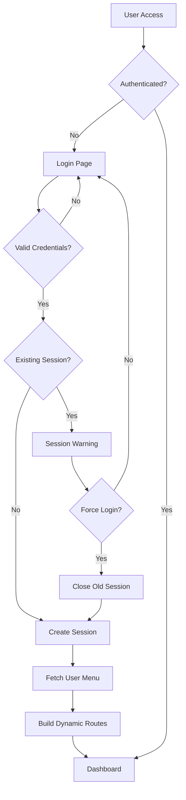
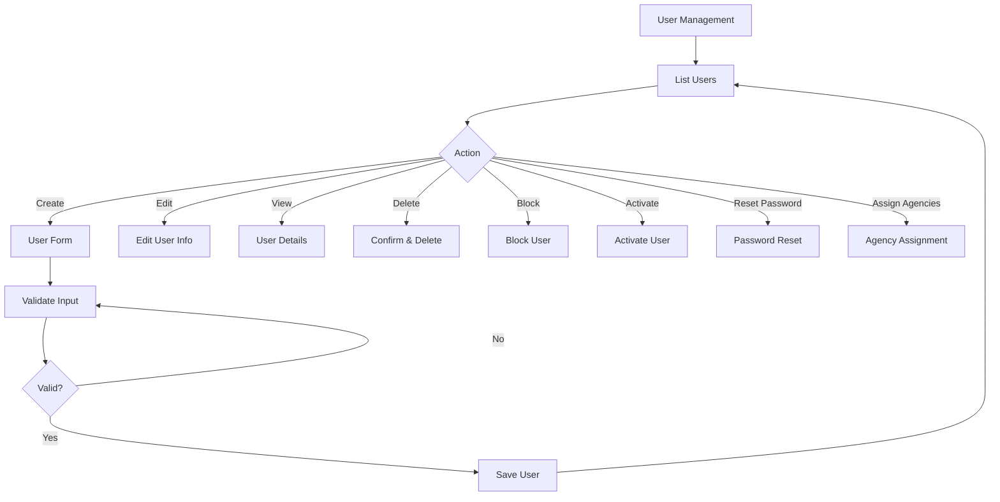
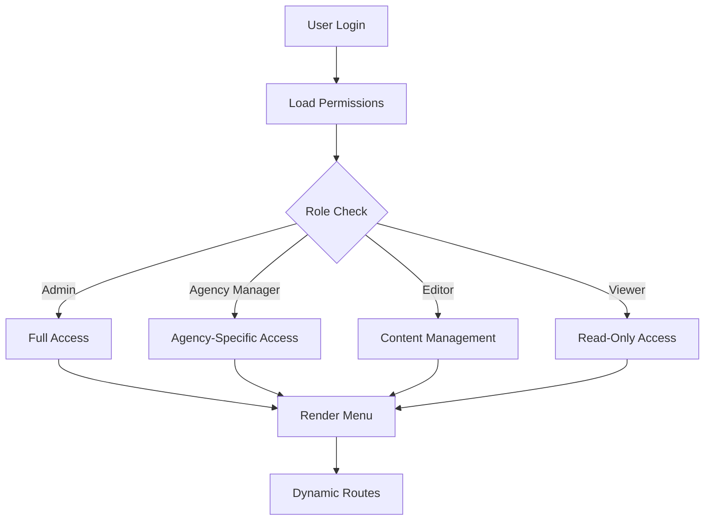

# News Dashboard - Algeria Press Service (APS)

[](https://opensource.org/licenses/MIT)
[](https://reactjs.org/)
[](https://vitejs.dev/)
[](https://mui.com/)

## 📋 Table of Contents

- [Introduction](#introduction)
- [Features](#features)
- [System Workflow](#system-workflow)
- [Architecture Overview](#architecture-overview)
- [Technology Stack](#technology-stack)
- [Prerequisites](#prerequisites)
- [Installation](#installation)
- [Configuration](#configuration)
- [Development](#development)
- [Production Deployment](#production-deployment)
- [Project Structure](#project-structure)
- [API Integration](#api-integration)
- [Security Features](#security-features)
- [Multi-Language Support](#multi-language-support)
- [Documentation](#documentation)
- [Contributing](#contributing)
- [License](#license)

## 🎯 Introduction

**News Dashboard** is a comprehensive web-based administrative interface for managing news content, users, agencies, and system logs for Algeria Press Service (APS). This modern, secure, and multilingual dashboard provides role-based access control, real-time statistics, and extensive logging capabilities.

### Mission

To provide a robust, secure, and user-friendly content management system that enables APS staff to efficiently manage news distribution, monitor system activities, and maintain editorial workflows across multiple news agencies and languages.

## ✨ Features

### 📊 Dashboard & Statistics
- **Real-time Statistics**: Live data visualization with charts (Bar, Line, Pie)
- **User Analytics**: Active users, connected users, user distribution
- **Agency Analytics**: Article counts per agency, publishing activity trends
- **Customizable Refresh Intervals**: Auto-refresh statistics at configurable intervals

### 👥 User Management
- **User CRUD Operations**: Create, read, update, delete user accounts
- **User States Management**: Active, inactive, blocked, deleted states
- **Password Management**: Reset user passwords with security validations
- **User Details**: Comprehensive user profile and activity information
- **Agency Assignment**: Assign/unassign users to/from agencies
- **Role-Based Access Control (RBAC)**: Fine-grained permission management

### 🏢 Agency Management
- **Agency CRUD Operations**: Manage news agencies
- **Agency Logo Management**: Upload and update agency logos
- **Multi-language Support**: Arabic and French names for agencies
- **Agency-User Association**: Manage relationships between users and agencies
- **Agency Status Control**: Activate/deactivate agencies

### ⚙️ Configuration
- **System Settings**: Configure application parameters
- **Agency Administration**: Centralized agency configuration
- **User Preferences**: Language selection, theme preferences
- **Refresh Intervals**: Configure data refresh timing

### 📝 Logging & Monitoring
- **Activity Logs**: Comprehensive audit trail of all user actions
- **Error Logs**: Track and monitor system errors
- **Connection Logs**: Monitor login attempts and failures
- **Session Management**: Track active sessions, last visits
- **Blocking Logs**: Record security-related blocks
- **Advanced Search**: Filter logs by date, level, user, action
- **Log Export**: Download logs in various formats (PDF, Excel, Word)

### 🔒 Security Features
- **Session Management**: Cookie-based authentication with session tracking
- **Duplicate Session Detection**: Prevent multiple concurrent sessions
- **SQL Injection Prevention**: Input validation and sanitization
- **XSS Protection**: Content sanitization with DOMPurify
- **Encrypted Storage**: AES encryption for sensitive local data
- **Security Headers**: CSP, HSTS, X-Frame-Options, etc.
- **Rate Limiting**: Protection against brute force attacks
- **Account Blocking**: Automatic blocking on suspicious activity
- **Password Policies**: Strong password requirements (6-20 characters)

### 🌐 Multi-Language Support
- **Arabic (RTL)**: Full right-to-left interface support
- **French (LTR)**: Default language
- **English (LTR)**: International support
- **Dynamic Language Switching**: Change language without page reload
- **Localized Content**: All UI elements translated

### 🎨 User Interface
- **Material-UI Design**: Modern, responsive interface
- **Dark/Light Theme Support**: Customizable themes
- **Mobile Responsive**: Optimized for all screen sizes
- **Accessibility**: WCAG 2.1 compliant
- **Toast Notifications**: User-friendly feedback messages
- **Confirm Dialogs**: Prevent accidental actions
- **Loading Indicators**: Clear feedback during operations

### 📤 Export & Reporting
- **PDF Export**: Generate PDF reports of users and articles
- **Excel Export**: Export data to Excel spreadsheets
- **Word Export**: Generate Word documents
- **Print Functionality**: Direct print support
- **Bulk Operations**: Batch export of filtered data

## 🔄 System Workflow

### Authentication Flow


### User Management Workflow


### Content Access Flow


## 🏗️ Architecture Overview

### Frontend Architecture

```
┌─────────────────────────────────────────────────┐
│                  Browser                         │
│  ┌───────────────────────────────────────────┐  │
│  │         React Application (SPA)           │  │
│  │  ┌─────────────────────────────────────┐  │  │
│  │  │      App Component (Router)         │  │  │
│  │  │  ┌───────────────────────────────┐  │  │  │
│  │  │  │   Context Provider            │  │  │  │
│  │  │  │   - Auth State                │  │  │  │
│  │  │  │   - User Data                 │  │  │  │
│  │  │  │   - Language                  │  │  │  │
│  │  │  │   - Routes                    │  │  │  │
│  │  │  └───────────────────────────────┘  │  │  │
│  │  │                                     │  │  │
│  │  │  ┌───────────────────────────────┐  │  │  │
│  │  │  │   Pages (Dynamic Routes)      │  │  │  │
│  │  │  │   - Dashboard                 │  │  │  │
│  │  │  │   - Users                     │  │  │  │
│  │  │  │   - Agencies                  │  │  │  │
│  │  │  │   - Logs                      │  │  │  │
│  │  │  │   - Configuration             │  │  │  │
│  │  │  └───────────────────────────────┘  │  │  │
│  │  └─────────────────────────────────────┘  │  │
│  └───────────────────────────────────────────┘  │
└─────────────────────────────────────────────────┘
                       │
                       │ HTTPS/REST API
                       ▼
┌─────────────────────────────────────────────────┐
│              Backend API Server                  │
│  (Node.js/Express or similar)                   │
│  - Authentication & Session Management          │
│  - User & Agency Management                     │
│  - Role-Based Access Control (RBAC)             │
│  - Logging & Monitoring                         │
└─────────────────────────────────────────────────┘
                       │
                       ▼
┌─────────────────────────────────────────────────┐
│              Database Layer                      │
│  - PostgreSQL/MySQL (Relational Data)           │
│  - User Accounts & Permissions                  │
│  - Agencies & Content                           │
│  - Audit Logs & Sessions                        │
└─────────────────────────────────────────────────┘
```

### Component Architecture

```
src/
├── App.jsx                    # Root component, routing, auth
├── main.jsx                   # Application entry point
├── Pages/                     # Page components
│   ├── Auth/                  # Login page
│   ├── Acceuil/              # Dashboard/Home
│   ├── Utilisateurs/         # User management
│   ├── Agences/              # Agency management
│   ├── Configuration/        # Settings
│   └── Logs/                 # Logging pages
├── Menu/                      # Navigation components
│   ├── NavBar/               # Top navigation bar
│   ├── SideBarMenu/          # Sidebar menu
│   └── Footer/               # Footer component
├── UI/                        # Reusable UI components
│   ├── Alerts/               # Confirmation dialogs
│   └── Pagination/           # Pagination component
├── Context/                   # React Context providers
├── services/                  # API service layer
│   └── useAxios.jsx          # HTTP client hook
├── helpers/                   # Utility functions
│   └── Gfunc.js              # Global functions
├── Locales/                   # Translations
│   └── translations.jsx      # Language files
└── assets/                    # Static assets
    ├── images/               # Images and logos
    └── styles/               # CSS and theme files
```

## 🛠️ Technology Stack

### Frontend
| Technology | Version | Purpose |
|-----------|---------|---------|
| **React** | 18.3.1 | UI library for building components |
| **Vite** | 5.4.10 | Build tool and development server |
| **React Router** | 6.28.0 | Client-side routing |
| **Material-UI (MUI)** | 6.1.7 | Component library and design system |
| **Emotion** | 11.13.3 | CSS-in-JS styling |
| **Axios** | 1.7.7 | HTTP client for API calls |
| **React Toastify** | 10.0.6 | Toast notifications |
| **Recharts** | 2.14.1 | Data visualization and charts |

### Data Processing & Export
| Technology | Version | Purpose |
|-----------|---------|---------|
| **ExcelJS** | 4.4.0 | Excel file generation |
| **docx** | 9.1.0 | Word document generation |
| **pdf-lib** | 1.17.1 | PDF manipulation |
| **html2canvas** | 1.4.1 | HTML to canvas conversion |
| **FileSaver.js** | 2.0.5 | Client-side file downloads |
| **print-js** | 1.6.0 | Print functionality |

### Security & Utilities
| Technology | Version | Purpose |
|-----------|---------|---------|
| **crypto-js** | 4.2.0 | AES encryption for local storage |
| **DOMPurify** | 3.2.4 | XSS protection and HTML sanitization |
| **loglevel** | 1.9.2 | Logging utility |
| **lodash** | 4.17.21 | Utility functions |
| **dayjs** | 1.11.13 | Date manipulation |

### Development Tools
| Technology | Version | Purpose |
|-----------|---------|---------|
| **ESLint** | 9.13.0 | Code linting |
| **esbuild** | 0.25.1 | JavaScript bundler |

### UI & Styling
- **Material Design Icons (@mdi/react)**: Icon library
- **stylis-plugin-rtl**: RTL language support
- **React Responsive**: Responsive design hooks

## 📋 Prerequisites

Before installing and running this application, ensure you have the following:

### Required Software
- **Node.js**: Version 18.x or higher
- **npm**: Version 9.x or higher (comes with Node.js)
- **Git**: For version control

### Backend Requirements
This frontend application requires a backend API server. Ensure the backend provides:
- RESTful API endpoints (see [API Integration](#api-integration))
- Cookie-based session management
- CORS configuration for the frontend domain
- HTTPS support (required for production)

### Browser Compatibility
- **Chrome/Edge**: Version 90+
- **Firefox**: Version 88+
- **Safari**: Version 14+

## 🚀 Installation

### 1. Clone the Repository

```bash
git clone <repository-url>
cd newonline-dashbord
```

### 2. Install Dependencies

```bash
npm install
```

This will install all required packages listed in `package.json`.

### 3. Environment Configuration

Create a `.env` file in the root directory:

```bash
cp .env.example .env
```

Edit `.env` with your configuration (see [Configuration](#configuration) section).

### 4. Verify Installation

```bash
npm run dev
```

If successful, you should see:
```
  VITE v5.4.10  ready in XXX ms

  ➜  Local:   http://localhost:5173/
  ➜  Network: use --host to expose
```

## ⚙️ Configuration

### Environment Variables

Create a `.env` file in the project root with the following variables:

```env
# Application Status (dev or prod)
VITE_APP_STATUS=dev

# API Configuration
VITE_BASE_URL=http://localhost:3000/api/v1/
VITE_IMAGE_URL=http://localhost:3000/uploads/

# Security
VITE_APP_ID=your-api-key-here
VITE_KEY=your-encryption-secret-key
VITE_PREF=_app

# Data Configuration
VITE_EMPTY_DATA=No data available
```

### Configuration Details

#### `VITE_APP_STATUS`
- **Values**: `dev` | `prod`
- **Purpose**: Determines which API URL to use
- **Default**: `dev`

#### `VITE_BASE_URL`
- **Type**: String (URL)
- **Purpose**: Backend API base URL for development
- **Example**: `http://localhost:3000/api/v1/`

#### `VITE_IMAGE_URL`
- **Type**: String (URL)
- **Purpose**: Base URL for serving images/uploads
- **Example**: `http://localhost:3000/uploads/`

#### `VITE_APP_ID`
- **Type**: String
- **Purpose**: API key for authenticating frontend requests
- **Security**: Keep this secret, never commit to version control

#### `VITE_KEY`
- **Type**: String
- **Purpose**: Secret key for AES encryption/decryption
- **Security**: Use a strong, random key; never commit to version control

#### `VITE_PREF`
- **Type**: String
- **Purpose**: Prefix for localStorage keys
- **Default**: `_app`

### Vite Configuration

Edit `vite.config.js` for build and server options:

```javascript
import { defineConfig } from "vite";
import react from "@vitejs/plugin-react";

export default defineConfig({
  plugins: [react()],
  
  // Production build configuration
  build: {
    outDir: "dist",
    emptyOutDir: true,
    sourcemap: false, // Set to true for debugging
    minify: "esbuild",
  },

  // Development server configuration
  server: {
    host: "localhost",
    port: 5173,
    strictPort: true,
    open: false,
  },
});
```

## 💻 Development

### Start Development Server

```bash
npm run dev
```

Access the application at `http://localhost:5173`

### Development Features
- **Hot Module Replacement (HMR)**: Instant updates on code changes
- **React Fast Refresh**: Preserve component state during edits
- **Source Maps**: Debug original code in browser DevTools
- **ESLint Integration**: Real-time linting

### Code Linting

```bash
# Run linter
npm run lint

# Auto-fix linting issues
npm run lint -- --fix
```

### Project Scripts

```bash
# Development server with HMR
npm run dev

# Build for production
npm run build

# Preview production build
npm run preview

# Run linter
npm run lint
```

### Development Workflow

1. **Create a feature branch**
   ```bash
   git checkout -b feature/your-feature-name
   ```

2. **Make changes and test**
   ```bash
   npm run dev
   # Test your changes
   ```

3. **Lint your code**
   ```bash
   npm run lint
   ```

4. **Build and verify**
   ```bash
   npm run build
   npm run preview
   ```

5. **Commit and push**
   ```bash
   git add .
   git commit -m "feat: your feature description"
   git push origin feature/your-feature-name
   ```

## 🚢 Production Deployment

### Build for Production

```bash
npm run build
```

This creates an optimized production build in the `dist/` directory.

### Build Output

```
dist/
├── index.html           # Main HTML file
├── assets/
│   ├── index-[hash].js  # Bundled JavaScript
│   ├── index-[hash].css # Bundled CSS
│   └── [images]         # Optimized images
└── favicon.ico          # Favicon
```

### Deployment Options

#### Option 1: Apache Server

```apache
# .htaccess
<IfModule mod_rewrite.c>
  RewriteEngine On
  RewriteBase /
  RewriteRule ^index\.html$ - [L]
  RewriteCond %{REQUEST_FILENAME} !-f
  RewriteCond %{REQUEST_FILENAME} !-d
  RewriteRule . /index.html [L]
</IfModule>

# Security Headers
<IfModule mod_headers.c>
  Header set X-Content-Type-Options "nosniff"
  Header set X-Frame-Options "SAMEORIGIN"
  Header set X-XSS-Protection "1; mode=block"
  Header set Referrer-Policy "no-referrer"
  Header set Permissions-Policy "geolocation=(), microphone=(), camera=()"
  Header set Strict-Transport-Security "max-age=31536000; includeSubDomains"
</IfModule>
```

Deploy steps:
```bash
# Build the application
npm run build

# Copy dist folder to Apache web root
cp -r dist/* /var/www/html/

# Set permissions
chown -R www-data:www-data /var/www/html
chmod -R 755 /var/www/html
```

#### Option 2: Nginx

```nginx
server {
    listen 80;
    server_name your-domain.com;
    
    # Redirect to HTTPS
    return 301 https://$server_name$request_uri;
}

server {
    listen 443 ssl http2;
    server_name your-domain.com;
    
    # SSL Configuration
    ssl_certificate /path/to/cert.pem;
    ssl_certificate_key /path/to/key.pem;
    
    # Root directory
    root /var/www/html/dist;
    index index.html;
    
    # SPA routing
    location / {
        try_files $uri $uri/ /index.html;
    }
    
    # Security headers
    add_header X-Content-Type-Options "nosniff" always;
    add_header X-Frame-Options "SAMEORIGIN" always;
    add_header X-XSS-Protection "1; mode=block" always;
    add_header Referrer-Policy "no-referrer" always;
    add_header Strict-Transport-Security "max-age=31536000; includeSubDomains" always;
    
    # Cache static assets
    location ~* \.(js|css|png|jpg|jpeg|gif|ico|svg)$ {
        expires 1y;
        add_header Cache-Control "public, immutable";
    }
}
```

#### Option 3: Docker

Create `Dockerfile`:

```dockerfile
# Build stage
FROM node:18-alpine AS builder
WORKDIR /app
COPY package*.json ./
RUN npm ci
COPY . .
RUN npm run build

# Production stage
FROM nginx:alpine
COPY --from=builder /app/dist /usr/share/nginx/html
COPY nginx.conf /etc/nginx/conf.d/default.conf
EXPOSE 80
CMD ["nginx", "-g", "daemon off;"]
```

Build and run:
```bash
docker build -t news-dashboard .
docker run -p 80:80 news-dashboard
```

#### Option 4: Static Hosting (Vercel, Netlify)

For platforms like Vercel or Netlify, configure the build settings:

**Build Command**: `npm run build`
**Output Directory**: `dist`
**Install Command**: `npm install`

### Post-Deployment Checklist

- [ ] Verify all environment variables are set correctly
- [ ] Test authentication flow
- [ ] Verify API connectivity
- [ ] Test all user roles and permissions
- [ ] Check SSL certificate validity
- [ ] Verify security headers are present
- [ ] Test responsive design on multiple devices
- [ ] Check browser console for errors
- [ ] Verify image loading
- [ ] Test export functionality (PDF, Excel, Word)
- [ ] Monitor error logs for any issues

## 📁 Project Structure

```
newonline-dashbord/
├── public/                      # Static public assets
│   └── favicon.ico             # Application favicon
│
├── src/                        # Source code
│   ├── App.jsx                 # Root component with routing
│   ├── App.css                 # Global application styles
│   ├── main.jsx                # Application entry point
│   ├── index.css               # Base CSS styles
│   │
│   ├── Pages/                  # Page components (routes)
│   │   ├── Auth/               # Authentication pages
│   │   │   └── index.jsx       # Login page
│   │   ├── Acceuil/            # Dashboard/Home page
│   │   │   ├── index.jsx       # Main dashboard
│   │   │   ├── indexParent.jsx # Parent wrapper
│   │   │   ├── admin.jsx       # Admin dashboard
│   │   │   ├── abonnees.jsx    # Subscribers view
│   │   │   └── AdvenceSearch.jsx # Advanced search
│   │   ├── Utilisateurs/       # User management
│   │   │   ├── index.jsx       # User list
│   │   │   ├── indexParent.jsx # Parent wrapper
│   │   │   ├── userAdd.jsx     # Add new user
│   │   │   ├── editUserInfo.jsx # Edit user
│   │   │   ├── userDetails.jsx  # User details
│   │   │   ├── restPassword.jsx # Reset password
│   │   │   └── userAgencies.jsx # User-agency assignment
│   │   ├── Agences/            # Agency management
│   │   │   ├── index.jsx       # Agency list
│   │   │   ├── agencyParent.jsx # Parent wrapper
│   │   │   ├── agencyList.jsx   # Agency listing
│   │   │   ├── agencyContent.jsx # Agency content
│   │   │   └── itemContent.jsx  # Item details
│   │   ├── Configuration/      # System configuration
│   │   │   ├── index.jsx       # Config main page
│   │   │   ├── indexParent.jsx # Parent wrapper
│   │   │   ├── agenciesAdd.jsx # Add agency
│   │   │   ├── agenciesImage.jsx # Manage logos
│   │   │   └── agenciesUser.jsx # Agency-user management
│   │   ├── Logs/               # Logging & monitoring
│   │   │   ├── logs_list.jsx   # Logs listing
│   │   │   ├── log_item.jsx    # Log details
│   │   │   └── sessions.jsx    # Active sessions
│   │   └── index.jsx           # Pages index/router
│   │
│   ├── Menu/                   # Navigation components
│   │   ├── NavBar/
│   │   │   └── index.jsx       # Top navigation bar
│   │   ├── SideBarMenu/
│   │   │   └── index.jsx       # Sidebar menu
│   │   └── Footer/
│   │       └── index.jsx       # Footer component
│   │
│   ├── UI/                     # Reusable UI components
│   │   ├── Alerts/
│   │   │   └── ConfirmDialogue.jsx # Confirmation dialog
│   │   └── Pagination/
│   │       └── index.jsx       # Pagination component
│   │
│   ├── Context/                # React Context
│   │   └── contextProvider.jsx # Global state context
│   │
│   ├── services/               # API service layer
│   │   └── useAxios.jsx        # Custom Axios hook
│   │
│   ├── helpers/                # Utility functions
│   │   └── Gfunc.js            # Global helper functions
│   │
│   ├── Locales/                # Internationalization
│   │   └── translations.jsx    # Translation strings (AR/FR/EN)
│   │
│   ├── Log/                    # Logging utilities
│   │   └── costumLog.jsx       # Custom logging implementation
│   │
│   ├── noData/                 # Empty state components
│   │   ├── noComponent.jsx     # 404 page
│   │   ├── noDataFound.jsx     # No data message
│   │   └── noStats.jsx         # No statistics message
│   │
│   └── assets/                 # Static assets
│       ├── images/             # Images and icons
│       │   ├── defaultImage.png
│       │   ├── user.png
│       │   ├── session.png
│       │   └── Logos/          # Logo files
│       ├── Styled/             # Styled components
│       │   ├── StyledCard.jsx
│       │   ├── StyledFieldset.jsx
│       │   └── StyledLegend.jsx
│       └── styles/             # CSS and themes
│           ├── article.css
│           ├── logs.css
│           ├── menu.css
│           ├── navbar.css
│           ├── sidebar.css
│           ├── stats.css
│           ├── theme.jsx       # MUI theme configuration
│           ├── drag-drop-input.css
│           └── datatable_costum.js
│
├── docs/                       # Documentation (see below)
├── .env                        # Environment variables (create from .env.example)
├── .env.example                # Environment template
├── .gitignore                  # Git ignore rules
├── eslint.config.js            # ESLint configuration
├── index.html                  # Main HTML template
├── package.json                # Dependencies and scripts
├── package-lock.json           # Locked dependencies
├── vite.config.js              # Vite configuration
└── README.md                   # This file
```

### Key Directories Explained

#### `/src/Pages/`
Contains all page-level components organized by feature. Each feature has its own subdirectory with related components.

#### `/src/services/`
API integration layer. Contains the `useAxios` hook for making HTTP requests with built-in error handling and security headers.

#### `/src/helpers/`
Utility functions used across the application including validation, formatting, encryption, and security functions.

#### `/src/Locales/`
Multi-language support files. Contains translation strings for Arabic, French, and English.

#### `/src/assets/`
Static assets including images, logos, styled components, and CSS files.

## 🔌 API Integration

### Backend Requirements

The frontend expects the following API endpoints:

#### Authentication Endpoints

```
POST /api/v1/auth/login
POST /api/v1/auth/logout
POST /api/v1/auth/close
```

#### User Management Endpoints

```
GET    /api/v1/users
GET    /api/v1/users/:id
POST   /api/v1/users
PUT    /api/v1/users/:id
DELETE /api/v1/users/:id
PUT    /api/v1/users/block
POST   /api/v1/users/menu
```

#### Agency Management Endpoints

```
GET    /api/v1/agencies
GET    /api/v1/agencies/:id
POST   /api/v1/agencies
PUT    /api/v1/agencies/:id
DELETE /api/v1/agencies/:id
```

### API Request Format

All requests include:
- **Cookie**: Session cookie for authentication
- **Headers**:
  - `x-api-key`: API authentication key
  - `Content-Type`: application/json
  - Security headers (see Security Features)

### API Response Format

Expected response structure:

```json
{
  "success": true,
  "data": { /* response data */ },
  "message": "Success message",
  "hasSession": true,
  "logout": false
}
```

Error response:

```json
{
  "success": false,
  "message": "Error message",
  "hasSession": false,
  "logout": true
}
```

For detailed API documentation, see [docs/api.md](./docs/api.md).

## 🔒 Security Features

### Authentication & Authorization
- **Cookie-based Sessions**: Secure, HTTP-only session cookies
- **Session Management**: Track and manage active user sessions
- **Duplicate Session Prevention**: Warn and handle multiple login attempts
- **Auto-logout**: Automatic logout on session expiration
- **Role-Based Access Control**: Fine-grained permissions per user role

### Input Validation & Sanitization
- **SQL Injection Prevention**: Server-side and client-side validation
- **XSS Protection**: DOMPurify sanitization of user inputs
- **Input Validation**: Email, phone, password format validation
- **Special Character Filtering**: Prevent malicious character injection

### Data Protection
- **AES Encryption**: Encrypted localStorage for sensitive data
- **Encrypted URLs**: Sensitive URL parameters are encrypted
- **Secure Password Storage**: Passwords never stored in localStorage
- **HTTPS Enforcement**: Strict-Transport-Security header

### Security Headers
```javascript
{
  "X-Content-Type-Options": "nosniff",
  "Referrer-Policy": "no-referrer",
  "Permissions-Policy": "geolocation=()",
  "Strict-Transport-Security": "max-age=31536000; includeSubDomains",
  "x-api-key": "your-api-key"
}
```

### Account Protection
- **Automatic Blocking**: Block accounts on suspicious activity
- **Failed Login Tracking**: Monitor and log failed login attempts
- **Password Policies**: Enforce strong password requirements
- **Account States**: Active, inactive, blocked, deleted states

### Logging & Monitoring
- **Activity Logs**: Comprehensive audit trail
- **Error Logging**: Track application errors
- **Security Events**: Log blocking, failed logins, suspicious activity
- **Session Tracking**: Monitor active sessions and last activity

For detailed security documentation, see [docs/security.md](./docs/security.md).

## 🌐 Multi-Language Support

### Supported Languages

1. **Arabic (العربية)**
   - Language Code: `ar` / ID: `1`
   - Direction: RTL (Right-to-Left)
   - Full UI translation
   - RTL-optimized layouts

2. **French (Français)**
   - Language Code: `fr` / ID: `2`
   - Direction: LTR (Left-to-Right)
   - Default language
   - Complete translation

3. **English**
   - Language Code: `en` / ID: `3`
   - Direction: LTR (Left-to-Right)
   - Full UI translation

### Language Switching

Users can switch languages from the user preferences menu. The selected language is:
- Stored in encrypted localStorage
- Applied to the entire interface instantly
- Persists across sessions
- Updates document direction (RTL/LTR)

### RTL Support

Arabic language triggers:
- Right-to-left text direction
- Mirrored layouts
- Flipped navigation
- RTL-aware components
- Proper text alignment

### Adding New Translations

Edit `src/Locales/translations.jsx`:

```javascript
export default {
  fr: { /* French translations */ },
  ar: { /* Arabic translations */ },
  en: { /* English translations */ },
  // Add new language:
  es: { /* Spanish translations */ }
};
```

## 📚 Documentation

Comprehensive documentation is available in the `/docs` directory:

- **[Architecture](./docs/architecture.md)**: System architecture, components, and design patterns
- **[API Documentation](./docs/api.md)**: Complete API endpoint reference
- **[Workflow](./docs/workflow.md)**: User workflows and business processes
- **[Permissions](./docs/permissions.md)**: RBAC system and permission management
- **[Database Schema](./docs/database-schema.md)**: Database structure and relationships
- **[Deployment](./docs/deployment.md)**: Detailed deployment instructions
- **[Security](./docs/security.md)**: Security features and best practices
- **[Folder Structure](./docs/folder-structure.md)**: Detailed project structure explanation

## 🤝 Contributing

We welcome contributions! Please follow these guidelines:

### How to Contribute

1. **Fork the repository**
2. **Create a feature branch**: `git checkout -b feature/amazing-feature`
3. **Make your changes**: Follow code style and add comments
4. **Test thoroughly**: Ensure no breaking changes
5. **Commit your changes**: `git commit -m 'feat: add amazing feature'`
6. **Push to the branch**: `git push origin feature/amazing-feature`
7. **Open a Pull Request**: Describe your changes clearly

### Code Style Guidelines

- Use ESLint configuration provided
- Add JSDoc comments for functions
- Follow React best practices
- Use meaningful variable names
- Keep components small and focused
- Write clear commit messages

### Commit Message Convention

Follow conventional commits:
- `feat:` New feature
- `fix:` Bug fix
- `docs:` Documentation changes
- `style:` Code style changes (formatting)
- `refactor:` Code refactoring
- `test:` Adding tests
- `chore:` Maintenance tasks

## 📄 License

This project is proprietary software developed for Algeria Press Service (APS).

**Copyright © 2024 Algeria Press Service (APS). All rights reserved.**

Unauthorized copying, modification, distribution, or use of this software is strictly prohibited without explicit written permission from APS.

## 📞 Support & Contact

For questions, issues, or support:

- **Organization**: Algeria Press Service (APS)
- **Website**: [aps.dz](https://www.aps.dz)
- **Email**: support@aps.dz

## 🙏 Acknowledgments

- **Algeria Press Service (APS)**: For the project requirements and support
- **React Team**: For the excellent UI library
- **Material-UI Team**: For the comprehensive component library
- **Vite Team**: For the fast build tool
- **All Contributors**: For their valuable contributions

---

**Built with ❤️ for Algeria Press Service (APS)**
