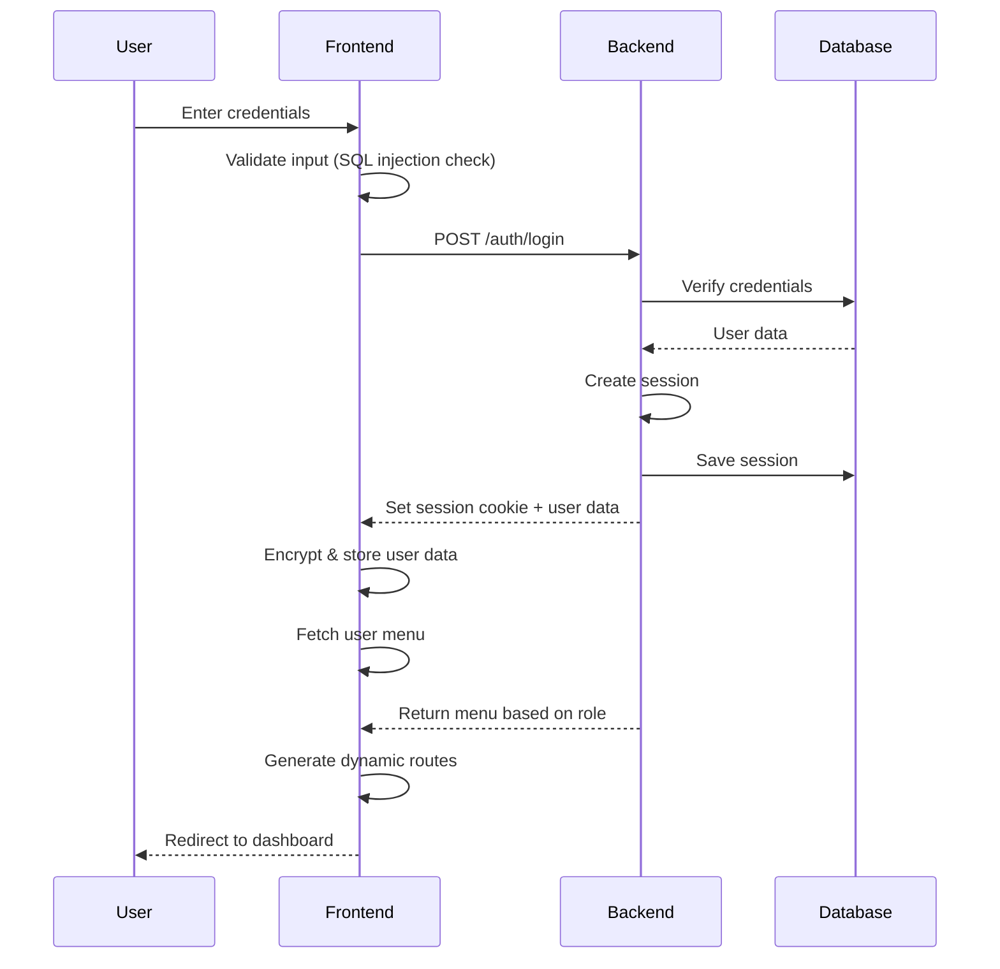

# System Architecture Documentation

## Table of Contents

- [Overview](#overview)
- [Frontend Architecture](#frontend-architecture)
- [Component Architecture](#component-architecture)
- [State Management](#state-management)
- [Routing Architecture](#routing-architecture)
- [Data Flow](#data-flow)
- [Security Architecture](#security-architecture)
- [Performance Optimization](#performance-optimization)
- [Scalability Considerations](#scalability-considerations)

## Overview

The News Dashboard is built as a modern Single Page Application (SPA) using React 18 with a component-based architecture. The system follows a three-tier architecture pattern:

1. **Presentation Layer**: React components with Material-UI
2. **Business Logic Layer**: Custom hooks, context providers, and utility functions
3. **Data Access Layer**: Axios-based API service with error handling

## Frontend Architecture

### High-Level Architecture

```
┌─────────────────────────────────────────────────────────────┐
│                      Browser Layer                           │
│  ┌───────────────────────────────────────────────────────┐  │
│  │              React Application (SPA)                  │  │
│  │                                                       │  │
│  │  ┌─────────────────────────────────────────────────┐ │  │
│  │  │           Application Shell (App.jsx)           │ │  │
│  │  │  ┌───────────────────────────────────────────┐  │ │  │
│  │  │  │     Router (React Router v6)              │  │ │  │
│  │  │  │  - Dynamic Route Generation               │  │ │  │
│  │  │  │  - Protected Routes                       │  │ │  │
│  │  │  │  - Lazy Loading                           │  │ │  │
│  │  │  └───────────────────────────────────────────┘  │ │  │
│  │  │                                                 │ │  │
│  │  │  ┌───────────────────────────────────────────┐  │ │  │
│  │  │  │     Context Provider (Global State)       │  │ │  │
│  │  │  │  - Authentication State                   │  │ │  │
│  │  │  │  - User Information                       │  │ │  │
│  │  │  │  - Language/Locale                        │  │ │  │
│  │  │  │  - Dynamic Routes                         │  │ │  │
│  │  │  │  - API Configuration                      │  │ │  │
│  │  │  └───────────────────────────────────────────┘  │ │  │
│  │  │                                                 │ │  │
│  │  │  ┌───────────────────────────────────────────┐  │ │  │
│  │  │  │     Theme Provider (MUI Theme)            │  │ │  │
│  │  │  │  - Material-UI Theme                      │  │ │  │
│  │  │  │  - RTL/LTR Support                        │  │ │  │
│  │  │  │  - Custom Styling                         │  │ │  │
│  │  │  └───────────────────────────────────────────┘  │ │  │
│  │  └─────────────────────────────────────────────────┘ │  │
│  │                                                       │  │
│  │  ┌─────────────────────────────────────────────────┐ │  │
│  │  │              Page Components                    │ │  │
│  │  │  ┌──────────────┐  ┌──────────────┐            │ │  │
│  │  │  │ Auth Pages   │  │ Dashboard    │            │ │  │
│  │  │  └──────────────┘  └──────────────┘            │ │  │
│  │  │  ┌──────────────┐  ┌──────────────┐            │ │  │
│  │  │  │ User Mgmt    │  │ Agency Mgmt  │            │ │  │
│  │  │  └──────────────┘  └──────────────┘            │ │  │
│  │  │  ┌──────────────┐  ┌──────────────┐            │ │  │
│  │  │  │ Logs         │  │ Config       │            │ │  │
│  │  │  └──────────────┘  └──────────────┘            │ │  │
│  │  └─────────────────────────────────────────────────┘ │  │
│  │                                                       │  │
│  │  ┌─────────────────────────────────────────────────┐ │  │
│  │  │          Shared UI Components                   │ │  │
│  │  │  - Navigation (Navbar, Sidebar, Footer)         │ │  │
│  │  │  - Dialogs & Alerts                            │ │  │
│  │  │  - Data Tables & Pagination                    │ │  │
│  │  │  - Forms & Inputs                              │ │  │
│  │  └─────────────────────────────────────────────────┘ │  │
│  │                                                       │  │
│  │  ┌─────────────────────────────────────────────────┐ │  │
│  │  │          Service Layer                          │ │  │
│  │  │  - useAxios Hook (HTTP Client)                  │ │  │
│  │  │  - API Request/Response Handling                │ │  │
│  │  │  - Error Handling & Retry Logic                 │ │  │
│  │  └─────────────────────────────────────────────────┘ │  │
│  │                                                       │  │
│  │  ┌─────────────────────────────────────────────────┐ │  │
│  │  │          Utility Layer                          │ │  │
│  │  │  - Helper Functions (Gfunc.js)                  │ │  │
│  │  │  - Validation & Sanitization                    │ │  │
│  │  │  - Encryption/Decryption                        │ │  │
│  │  │  - Formatting & Transformation                  │ │  │
│  │  └─────────────────────────────────────────────────┘ │  │
│  └───────────────────────────────────────────────────────┘  │
└─────────────────────────────────────────────────────────────┘
                              │
                              │ HTTPS/REST API
                              │ (Axios with interceptors)
                              ▼
┌─────────────────────────────────────────────────────────────┐
│                     Backend API Server                       │
│                   (Node.js/Express or similar)              │
│                                                             │
│  ┌───────────────────────────────────────────────────────┐  │
│  │              API Gateway/Router                       │  │
│  │  - Request Validation                                 │  │
│  │  - Authentication Middleware                          │  │
│  │  - Rate Limiting                                      │  │
│  └───────────────────────────────────────────────────────┘  │
│                                                             │
│  ┌───────────────────────────────────────────────────────┐  │
│  │          Business Logic Layer                         │  │
│  │  - User Management Service                            │  │
│  │  - Agency Management Service                          │  │
│  │  - Authentication Service                             │  │
│  │  - Logging Service                                    │  │
│  │  - Permission Service (RBAC)                          │  │
│  └───────────────────────────────────────────────────────┘  │
│                                                             │
│  ┌───────────────────────────────────────────────────────┐  │
│  │          Data Access Layer (ORM/Query Builder)        │  │
│  └───────────────────────────────────────────────────────┘  │
└─────────────────────────────────────────────────────────────┘
                              │
                              ▼
┌─────────────────────────────────────────────────────────────┐
│                     Database Layer                          │
│                                                             │
│  ┌───────────────────────────────────────────────────────┐  │
│  │         Relational Database (PostgreSQL/MySQL)        │  │
│  │                                                       │  │
│  │  - users                  (User accounts)             │  │
│  │  - agencies               (News agencies)             │  │
│  │  - roles                  (User roles)                │  │
│  │  - permissions            (Access permissions)        │  │
│  │  - user_agencies          (User-Agency mapping)       │  │
│  │  - sessions               (Active sessions)           │  │
│  │  - logs                   (Audit logs)                │  │
│  │  - articles               (News articles)             │  │
│  └───────────────────────────────────────────────────────┘  │
└─────────────────────────────────────────────────────────────┘
```

## Component Architecture

### Component Hierarchy

```
App (Root)
│
├── CacheProvider (RTL/LTR)
│   └── ThemeProvider (MUI Theme)
│       └── ContextProvider (Global State)
│           └── Router (React Router)
│               │
│               ├── Route: /login
│               │   └── Login Component
│               │       ├── LoginForm
│               │       ├── LanguageSelector
│               │       └── ConfirmDialog (Session Warning)
│               │
│               └── Route: / (Protected)
│                   └── Main Layout
│                       │
│                       ├── Navbar
│                       │   ├── MenuToggle
│                       │   ├── UserMenu
│                       │   └── LanguageSwitcher
│                       │
│                       ├── Sidebar
│                       │   └── DynamicMenu
│                       │       └── MenuItem[]
│                       │
│                       ├── Content (Outlet)
│                       │   │
│                       │   ├── Dashboard (Acceuil)
│                       │   │   ├── Statistics
│                       │   │   │   ├── UserStats
│                       │   │   │   ├── AgencyStats
│                       │   │   │   └── Charts
│                       │   │   ├── ConnectedUsers
│                       │   │   └── LatestNews
│                       │   │
│                       │   ├── Users (Utilisateurs)
│                       │   │   ├── UserList
│                       │   │   │   ├── DataTable
│                       │   │   │   ├── Pagination
│                       │   │   │   └── ActionButtons
│                       │   │   ├── UserAdd
│                       │   │   ├── UserEdit
│                       │   │   ├── UserDetails
│                       │   │   ├── PasswordReset
│                       │   │   └── UserAgencies
│                       │   │
│                       │   ├── Agencies (Agences)
│                       │   │   ├── AgencyList
│                       │   │   ├── AgencyContent
│                       │   │   └── AgencyDetails
│                       │   │
│                       │   ├── Configuration
│                       │   │   ├── AgencySettings
│                       │   │   ├── AgencyImage
│                       │   │   └── AgencyUsers
│                       │   │
│                       │   └── Logs
│                       │       ├── LogList
│                       │       ├── LogItem
│                       │       └── Sessions
│                       │
│                       └── Footer
│
└── ToastContainer (Notifications)
```

### Component Design Patterns

#### 1. Container/Presentational Pattern

**Container Components** (Smart Components):
- Manage state and business logic
- Connect to Context API or external services
- Handle data fetching and transformations
- Examples: `UserParent`, `AgencyParent`, `HomeParent`

**Presentational Components** (Dumb Components):
- Pure, stateless UI components
- Receive data via props
- Focus on rendering and user interaction
- Examples: `UserList`, `Pagination`, `ConfirmDialog`

#### 2. Custom Hooks Pattern

Custom hooks encapsulate reusable logic:

```javascript
// useAxios - HTTP request management
const { response, loading, error, fetchData, clearData } = useAxios({
  method: "post",
  url: "/api/users",
  body: { /* data */ }
});
```

#### 3. Higher-Order Component (HOC) Pattern

Used for:
- Protected routes (authentication check)
- Theme wrapping (RTL/LTR)
- Error boundaries

#### 4. Render Props Pattern

Used in:
- Confirmation dialogs
- Modal windows
- Custom form components

### Key Components

#### App.jsx
**Purpose**: Root component managing authentication, routing, and global state

**Responsibilities**:
- Initialize authentication state
- Fetch user menu permissions
- Build dynamic routes based on user role
- Manage language selection (AR/FR/EN)
- Provide global context to all children
- Handle RTL/LTR theme caching

**Key Features**:
- Dynamic component importing
- Route protection
- Session management
- Multi-language support

#### Main.jsx (Pages/index.jsx)
**Purpose**: Main layout wrapper with navigation

**Structure**:
```
Main Layout
├── Navbar (Top)
├── Sidebar (Left)
├── Content (Center - Outlet)
└── Footer (Bottom)
```

**Responsive Design**:
- Desktop: Sidebar + Content side-by-side
- Mobile: Collapsible sidebar overlay

#### useAxios.jsx
**Purpose**: Custom hook for HTTP requests

**Features**:
- Loading state management
- Error handling with user feedback
- Security headers injection
- Session expiration handling
- Automatic logout on authentication failure

**Security Headers**:
```javascript
{
  "X-Content-Type-Options": "nosniff",
  "Referrer-Policy": "no-referrer",
  "Permissions-Policy": "geolocation=()",
  "Strict-Transport-Security": "max-age=31536000",
  "x-api-key": "API_KEY"
}
```

## State Management

### Global State (Context API)

The application uses React Context API for global state management:

```javascript
ContextProvider {
  handleValidateLogin,    // Function to set logged-in state
  handleDisconnect,       // Function to logout
  baseUrl,                // API base URL
  emptyData,              // Empty state message
  routes,                 // Dynamic routes based on permissions
  ImageUrl,               // Base URL for images
  lang,                   // Current language object
  prefixe,                // LocalStorage key prefix
  secretKey,              // Encryption key
  updateRoutes            // Function to refresh routes
}
```

### Local Component State

Components use `useState` for:
- Form inputs
- Loading indicators
- Modal visibility
- Pagination state
- Filter/search parameters

### State Persistence

**LocalStorage** (Encrypted with AES):
- `isLogged{prefix}`: Authentication state
- `langId{prefix}`: Selected language ID
- `username{prefix}`: Current username

**SessionStorage**:
- Temporary data cleared on tab close
- Not currently used extensively

## Routing Architecture

### Dynamic Routing System

Routes are generated dynamically based on user permissions:

```javascript
// Fetch user menu from API
const menuResponse = await fetch('/api/users/menu');

// Transform menu into route configuration
const routes = transformMenuToRoutes(menuResponse.data);

// Render dynamic routes
<Routes>
  {routes.map(route => (
    <Route key={route.path} path={route.path} element={route.component}>
      {route.children?.map(child => (
        <Route key={child.path} path={child.path} element={child.component} />
      ))}
    </Route>
  ))}
</Routes>
```

### Route Protection

```javascript
// Public route (login)
<Route 
  path="/login" 
  element={!isLogged ? <Login /> : <Navigate to="/" />} 
/>

// Protected routes
<Route 
  path="/" 
  element={isLogged ? <Main /> : <Navigate to="/login" />}
>
  {/* Child routes */}
</Route>
```

### Route Structure

```
/ (Protected)
├── /acceuil (Dashboard)
├── /utilisateurs (Users)
│   ├── / (List)
│   ├── /add (Add User)
│   ├── /edit/:id (Edit User)
│   └── /details/:id (User Details)
├── /agences (Agencies)
│   ├── / (List)
│   └── /:slug (Agency Details)
│       ├── / (Overview)
│       └── /:id (Item Details)
├── /configuration (Settings)
│   ├── / (Main Config)
│   ├── /agencies (Agency Config)
│   └── /users (User Config)
└── /logs (Logs)
    ├── / (Log List)
    ├── /agences (Agency Logs)
    ├── /users (User Logs)
    ├── /blocage (Block Logs)
    ├── /erreurs_connexion (Login Errors)
    └── /sessions (Active Sessions)
```

## Data Flow

### Request Flow

```
User Action
    │
    ▼
Component Event Handler
    │
    ▼
useAxios Hook (fetchData)
    │
    ├── Set loading=true
    │
    ▼
Axios Request
    │
    ├── Add Security Headers
    ├── Include Credentials (cookies)
    │
    ▼
Backend API
    │
    ├── Validate Session
    ├── Check Permissions
    ├── Process Request
    │
    ▼
Database Query
    │
    ▼
Backend Response
    │
    ▼
Axios Response Handler
    │
    ├── Success → setResponse(data)
    ├── Error → setError(message)
    │   ├── Session Invalid → Logout
    │   └── Other Error → Display Toast
    │
    ▼
Component Receives Update
    │
    ├── Update UI
    └── Set loading=false
```

### State Update Flow

```
User Input
    │
    ▼
Component State Update (useState)
    │
    ▼
Validation (if applicable)
    │
    ├── Valid → Continue
    └── Invalid → Show Error
    │
    ▼
Submit Form
    │
    ▼
API Request (useAxios)
    │
    ▼
Backend Processing
    │
    ▼
Success Response
    │
    ├── Update Local State
    ├── Show Success Toast
    ├── Refresh Data (fetchData)
    └── Navigate (if needed)
```

## Security Architecture

### Authentication Flow



### Security Layers

#### Layer 1: Input Validation (Client-Side)
- SQL injection detection patterns
- XSS prevention with DOMPurify
- Email/phone format validation
- Password strength checks
- Special character filtering

#### Layer 2: Encrypted Storage
- AES encryption for localStorage data
- Encrypted URL parameters
- No sensitive data in plain text
- Automatic cleanup on logout

#### Layer 3: API Security
- HTTP-only session cookies
- Security headers on all requests
- API key authentication
- CORS configuration
- Rate limiting (backend)

#### Layer 4: Session Management
- Server-side session validation
- Duplicate session detection
- Auto-logout on expiration
- Activity tracking

## Performance Optimization

### Code Splitting

```javascript
// Dynamic imports for route components
const DynamicComponent = async (key) => {
  const module = await import(`./Pages/${key}/index.jsx`);
  return module.default;
};
```

**Benefits**:
- Smaller initial bundle size
- Faster page load
- On-demand loading of routes

### Lazy Loading

Images and heavy components are loaded on-demand:
- Agency logos loaded when visible
- Charts rendered only when dashboard is accessed
- Large datasets paginated

### Memoization

Using React.memo and useMemo for:
- Heavy calculations
- Filtered/sorted data
- Expensive renders

### Virtual Scrolling

For large lists:
- User lists
- Log tables
- Agency content

### Caching Strategy

```javascript
// Cache API responses
const { response, fetchData } = useAxios({ /* config */ });

// Don't refetch if data exists
if (!response) {
  fetchData();
}
```

## Scalability Considerations

### Horizontal Scaling

The SPA architecture allows easy scaling:
- Frontend served as static files
- CDN distribution
- Load balancing for API requests
- Stateless API design

### Modular Architecture

- Feature-based folder structure
- Independent page components
- Reusable UI components
- Pluggable services

### Future Enhancements

1. **State Management**: Consider Redux/Zustand for complex state
2. **Micro-frontends**: Split by features for large teams
3. **Service Workers**: Offline support and caching
4. **Web Workers**: Heavy computations off main thread
5. **GraphQL**: More efficient data fetching
6. **Real-time Updates**: WebSocket integration for live data

### Monitoring & Analytics

Consider adding:
- Error tracking (Sentry)
- Performance monitoring (Lighthouse CI)
- User analytics (Google Analytics)
- Real-time monitoring dashboards

---

**Last Updated**: 2024
**Author**: APS Development Team
