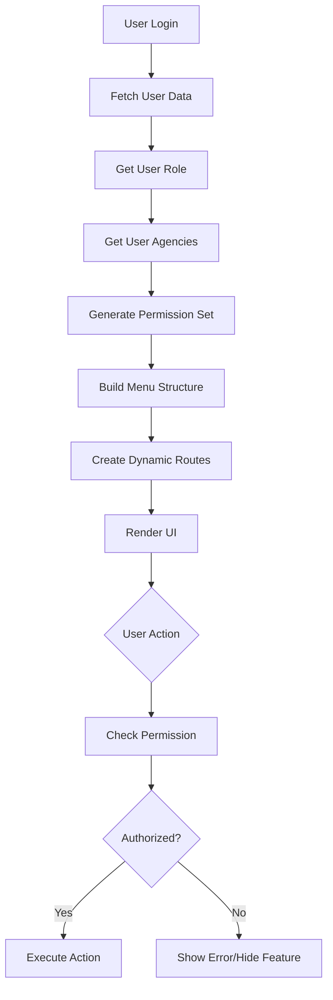

# Permissions & Access Control Documentation

## Table of Contents

- [Overview](#overview)
- [RBAC System](#rbac-system)
- [User Roles](#user-roles)
- [Permission Levels](#permission-levels)
- [Dynamic Menu System](#dynamic-menu-system)
- [Agency-Based Access](#agency-based-access)
- [Route Protection](#route-protection)
- [Permission Checking](#permission-checking)
- [Special Permissions](#special-permissions)

## Overview

The News Dashboard implements a comprehensive Role-Based Access Control (RBAC) system combined with agency-based permissions. This allows fine-grained control over what users can see and do within the application.

### Key Concepts

1. **Roles**: Define general capability levels (Super Admin, Admin, Editor, etc.)
2. **Agencies**: Scope access to specific news agencies
3. **Permissions**: Specific actions users can perform
4. **Dynamic Menus**: UI adapts based on user permissions
5. **Protected Routes**: Routes are accessible only with proper permissions

## RBAC System

### Architecture

```
User
  ├── Role (defines capabilities)
  │   └── Permissions (specific actions)
  └── Agencies (scope of access)
      └── Content Access (agency-specific content)
```

### Permission Flow



## User Roles

### Role Hierarchy

```
1. Super Administrator (highest authority)
   └── 2. Administrator
       └── 3. Agency Manager
           └── 4. Editor
               └── 5. Journalist
                   └── 6. Viewer (lowest authority)
```

### Role Definitions

#### 1. Super Administrator

**Description**: Highest authority with full system access

**Capabilities**:
- Full user management (create, edit, delete, block, unblock)
- Full agency management (create, edit, delete)
- System configuration access
- View all logs (user, agency, security, error)
- Export all data
- Manage all roles and permissions
- Access all agencies without restrictions
- Override any permission

**Menu Access**:
- Dashboard (Acceuil)
- Users (Utilisateurs)
- All Agencies
- Configuration
- Logs (all types)

**Use Cases**:
- System administrators
- IT staff
- Top-level management

---

#### 2. Administrator

**Description**: High-level access for managing users and content

**Capabilities**:
- User management (create, edit, delete, block)
- Agency management (edit assigned agencies only)
- View and manage users
- Access logs (limited to own agencies)
- Export data (own agencies)
- Cannot create/delete agencies
- Cannot modify system configuration

**Restrictions**:
- Cannot access system configuration
- Cannot manage Super Administrator accounts
- Cannot create new agencies
- Limited log access

**Menu Access**:
- Dashboard
- Users
- Assigned Agencies
- Logs (filtered)

**Use Cases**:
- Department heads
- Senior editors
- Content managers

---

#### 3. Agency Manager

**Description**: Manages a specific news agency

**Capabilities**:
- View users in their agency
- Manage content for their agency
- View agency statistics
- Cannot create/edit users
- Cannot access other agencies
- Limited log viewing

**Restrictions**:
- Cannot modify user accounts
- Cannot access system configuration
- Cannot view other agencies
- Cannot access security logs

**Menu Access**:
- Dashboard (own agency stats)
- Own Agency
- Limited logs

**Use Cases**:
- Agency directors
- Bureau chiefs

---

#### 4. Editor

**Description**: Creates and manages content

**Capabilities**:
- Create articles/content
- Edit all content in assigned agencies
- Publish content
- View statistics
- Cannot manage users
- Cannot manage agencies

**Restrictions**:
- No user management
- No agency management
- No log access
- No system configuration

**Menu Access**:
- Dashboard
- Assigned Agencies (content only)

**Use Cases**:
- Content editors
- News editors
- Copy editors

---

#### 5. Journalist

**Description**: Creates content but limited editing

**Capabilities**:
- Create articles
- Edit own articles only
- Submit for review
- View own statistics
- Cannot publish without approval
- Cannot edit others' content

**Restrictions**:
- Cannot edit others' content
- Cannot publish directly
- No user management
- No agency management
- No log access

**Menu Access**:
- Dashboard (limited)
- Assigned Agencies (own content)

**Use Cases**:
- Reporters
- Contributors
- Freelance writers

---

#### 6. Viewer

**Description**: Read-only access

**Capabilities**:
- View published content
- View statistics
- Access assigned agencies
- No editing capabilities
- No management functions

**Restrictions**:
- Cannot create content
- Cannot edit anything
- Cannot manage users/agencies
- Cannot access logs
- Read-only access

**Menu Access**:
- Dashboard (view only)
- Assigned Agencies (read-only)

**Use Cases**:
- Observers
- Auditors
- External reviewers

## Permission Levels

### Permission Matrix

| Permission | Super Admin | Admin | Agency Mgr | Editor | Journalist | Viewer |
|-----------|:-----------:|:-----:|:----------:|:------:|:----------:|:------:|
| **User Management** |
| `user.view` | ✓ | ✓ | ✓ | ✓ | ✗ | ✗ |
| `user.create` | ✓ | ✓ | ✗ | ✗ | ✗ | ✗ |
| `user.edit` | ✓ | ✓ | ✗ | ✗ | ✗ | ✗ |
| `user.delete` | ✓ | ✓ | ✗ | ✗ | ✗ | ✗ |
| `user.block` | ✓ | ✓ | ✗ | ✗ | ✗ | ✗ |
| `user.unblock` | ✓ | ✓ | ✗ | ✗ | ✗ | ✗ |
| `user.reset_password` | ✓ | ✓ | ✗ | ✗ | ✗ | ✗ |
| `user.assign_agencies` | ✓ | ✓ | ✗ | ✗ | ✗ | ✗ |
| **Agency Management** |
| `agency.view` | ✓ | ✓ | ✓ | ✓ | ✓ | ✓ |
| `agency.view_all` | ✓ | ✓ | ✗ | ✗ | ✗ | ✗ |
| `agency.create` | ✓ | ✗ | ✗ | ✗ | ✗ | ✗ |
| `agency.edit` | ✓ | Limited | ✗ | ✗ | ✗ | ✗ |
| `agency.delete` | ✓ | ✗ | ✗ | ✗ | ✗ | ✗ |
| `agency.manage_users` | ✓ | ✓ | ✗ | ✗ | ✗ | ✗ |
| `agency.update_logo` | ✓ | ✓ | Limited | ✗ | ✗ | ✗ |
| **Content Management** |
| `content.view` | ✓ | ✓ | ✓ | ✓ | ✓ | ✓ |
| `content.view_all` | ✓ | ✓ | ✗ | ✗ | ✗ | ✗ |
| `content.create` | ✓ | ✓ | ✓ | ✓ | ✓ | ✗ |
| `content.edit` | ✓ | ✓ | ✓ | ✓ | Own | ✗ |
| `content.edit_all` | ✓ | ✓ | ✓ | ✓ | ✗ | ✗ |
| `content.delete` | ✓ | ✓ | ✓ | ✓ | ✗ | ✗ |
| `content.publish` | ✓ | ✓ | ✓ | ✓ | ✗ | ✗ |
| **Logging & Monitoring** |
| `logs.view` | ✓ | ✓ | Limited | ✗ | ✗ | ✗ |
| `logs.view_all` | ✓ | ✓ | ✗ | ✗ | ✗ | ✗ |
| `logs.export` | ✓ | ✓ | ✗ | ✗ | ✗ | ✗ |
| `logs.user` | ✓ | ✓ | ✗ | ✗ | ✗ | ✗ |
| `logs.agency` | ✓ | ✓ | Limited | ✗ | ✗ | ✗ |
| `logs.security` | ✓ | ✗ | ✗ | ✗ | ✗ | ✗ |
| `logs.error` | ✓ | ✓ | ✗ | ✗ | ✗ | ✗ |
| `sessions.view` | ✓ | ✓ | ✗ | ✗ | ✗ | ✗ |
| `sessions.terminate` | ✓ | ✓ | ✗ | ✗ | ✗ | ✗ |
| **Configuration** |
| `config.view` | ✓ | ✗ | ✗ | ✗ | ✗ | ✗ |
| `config.edit` | ✓ | ✗ | ✗ | ✗ | ✗ | ✗ |
| `config.agency` | ✓ | ✓ | Limited | ✗ | ✗ | ✗ |
| **Statistics** |
| `stats.view` | ✓ | ✓ | ✓ | ✓ | Limited | Limited |
| `stats.view_all` | ✓ | ✓ | ✗ | ✗ | ✗ | ✗ |
| `stats.export` | ✓ | ✓ | ✗ | ✗ | ✗ | ✗ |
| **Data Export** |
| `export.users` | ✓ | ✓ | ✗ | ✗ | ✗ | ✗ |
| `export.articles` | ✓ | ✓ | ✓ | ✓ | ✗ | ✗ |
| `export.logs` | ✓ | ✓ | ✗ | ✗ | ✗ | ✗ |

### Permission Notation

**Legend**:
- `✓` - Full access
- `Limited` - Restricted access (e.g., own agencies only)
- `Own` - Can only access/modify own content
- `✗` - No access

## Dynamic Menu System

### How It Works

1. **User Login**: User authenticates successfully
2. **Fetch Permissions**: Backend returns user role and assigned agencies
3. **Menu Generation**: Frontend calls `/api/users/menu` endpoint
4. **Menu Response**: Backend returns menu structure based on permissions
5. **Route Building**: Frontend dynamically creates routes
6. **UI Rendering**: Menu items appear based on accessible features

### Menu Structure Example

**Super Administrator Menu**:
```json
{
  "Acceuil": "Acceuil",
  "Utilisateurs": "Utilisateurs",
  "Fils_de_presse": {
    "Fils_de_presse": [
      {
        "id_agency": 1,
        "name": "APS Arabe",
        "name_ar": "وكالة الأنباء الجزائرية",
        "alias": "aps-arabe"
      },
      {
        "id_agency": 2,
        "name": "APS Français",
        "name_ar": "وكالة باللغة الفرنسية",
        "alias": "aps-francais"
      }
    ]
  },
  "Configuration": "Configuration",
  "Logs": "Logs"
}
```

**Editor Menu** (limited):
```json
{
  "Acceuil": "Acceuil",
  "Fils_de_presse": {
    "Fils_de_presse": [
      {
        "id_agency": 1,
        "name": "APS Arabe",
        "alias": "aps-arabe"
      }
    ]
  }
}
```

### Menu Rendering Logic

```javascript
// In App.jsx
useEffect(() => {
  const fetchRoutes = async () => {
    if (response && response?.data?.success) {
      const menuData = response?.data?.data;
      const routes = [];
      
      for (const key of Object.keys(menuData)) {
        if (typeof menuData[key] === "string") {
          // Simple menu item (e.g., "Acceuil", "Utilisateurs")
          const component = await DynamicComponent(key);
          routes.push({
            path: key.toLowerCase(),
            component: component
          });
        } else if (typeof menuData[key] === "object") {
          // Nested menu with agencies
          const agencies = menuData[key][Object.keys(menuData[key])[0]];
          const component = await DynamicComponent(key);
          routes.push({
            path: key.toLowerCase(),
            component: component,
            children: agencies.map(agency => ({
              path: agency.alias,
              component: <AgencyContent />
            }))
          });
        }
      }
      
      setRoutes(routes);
    }
  };
  
  fetchRoutes();
}, [response]);
```

## Agency-Based Access

### Agency Assignment

Users can be assigned to one or more agencies:

```
User: john_doe
└── Assigned Agencies:
    ├── APS Arabe (id: 1)
    ├── APS Français (id: 2)
    └── APS English (id: 3)
```

### Access Scope

```javascript
// User can only access content from assigned agencies
const userAgencies = [1, 2, 3]; // APS Arabe, Français, English

// When fetching articles:
GET /api/articles?agency_id=1 // ✓ Allowed
GET /api/articles?agency_id=4 // ✗ Forbidden
GET /api/articles              // Returns only articles from agencies 1, 2, 3
```

### Agency-Level Permissions

#### Full Agency Access (Super Admin)
```javascript
{
  agencies: "all",
  can_view_all: true,
  can_create: true,
  can_edit: true,
  can_delete: true
}
```

#### Limited Agency Access (Editor)
```javascript
{
  agencies: [1, 2],
  can_view_all: false,
  can_create: true,
  can_edit: true,
  can_delete: false
}
```

#### Read-Only Agency Access (Viewer)
```javascript
{
  agencies: [1],
  can_view_all: false,
  can_create: false,
  can_edit: false,
  can_delete: false
}
```

## Route Protection

### Protected Route Implementation

```javascript
// In App.jsx
<Routes>
  {/* Public Route */}
  <Route 
    path="/login" 
    element={!isLogged ? <Login /> : <Navigate to="/" />} 
  />
  
  {/* Protected Routes */}
  <Route 
    path="/" 
    element={isLogged ? <Main /> : <Navigate to="/login" />}
  >
    {/* Dynamic routes based on permissions */}
    {routes.map((route, index) => (
      <Route
        key={index}
        path={route.path}
        element={route.component}
      >
        {/* Nested routes if applicable */}
      </Route>
    ))}
  </Route>
  
  {/* 404 Route */}
  <Route path="*" element={<Error404 />} />
</Routes>
```

### Route Access Check

```javascript
// Before rendering route content
function checkRouteAccess(requiredPermission) {
  const userPermissions = getUserPermissions();
  
  if (!userPermissions.includes(requiredPermission)) {
    // Redirect to dashboard or show error
    return <Navigate to="/" />;
  }
  
  // Render the route
  return <RouteComponent />;
}
```

## Permission Checking

### Client-Side Permission Check

```javascript
// Helper function in Gfunc.js or permission utility
export const hasPermission = (permission) => {
  const userRole = Gfunc.useDecryptedLocalStorage('userRole' + prefixe, secretKey);
  const userAgencies = JSON.parse(
    Gfunc.useDecryptedLocalStorage('userAgencies' + prefixe, secretKey)
  );
  
  // Permission logic
  switch (permission) {
    case 'user.create':
      return ['super_admin', 'admin'].includes(userRole);
    
    case 'user.view':
      return ['super_admin', 'admin', 'agency_manager', 'editor'].includes(userRole);
    
    case 'agency.create':
      return userRole === 'super_admin';
    
    // ... more permissions
    
    default:
      return false;
  }
};

// Usage in component
{hasPermission('user.create') && (
  <Button onClick={handleCreateUser}>Add User</Button>
)}
```

### Server-Side Permission Check (Backend)

```javascript
// Middleware to check permission
function checkPermission(requiredPermission) {
  return (req, res, next) => {
    const user = req.session.user;
    
    if (!user) {
      return res.status(401).json({
        success: false,
        error: 'UNAUTHORIZED',
        message: 'Authentication required'
      });
    }
    
    if (!user.permissions.includes(requiredPermission)) {
      return res.status(403).json({
        success: false,
        error: 'FORBIDDEN',
        message: 'Insufficient permissions'
      });
    }
    
    next();
  };
}

// Usage in routes
router.post('/users', checkPermission('user.create'), createUser);
router.delete('/users/:id', checkPermission('user.delete'), deleteUser);
```

### Feature-Level Permission

```javascript
// Conditional rendering based on permissions
function UserList({ users }) {
  const canEdit = hasPermission('user.edit');
  const canDelete = hasPermission('user.delete');
  const canBlock = hasPermission('user.block');
  
  return (
    <Table>
      {users.map(user => (
        <TableRow key={user.id}>
          <TableCell>{user.username}</TableCell>
          <TableCell>
            {canEdit && <EditButton user={user} />}
            {canDelete && <DeleteButton user={user} />}
            {canBlock && <BlockButton user={user} />}
          </TableCell>
        </TableRow>
      ))}
    </Table>
  );
}
```

## Special Permissions

### System Override (Super Admin Only)

Super Administrators have special override permissions:

```javascript
{
  can_override: true,
  can_access_all: true,
  bypass_restrictions: true
}
```

**Capabilities**:
- Access any agency regardless of assignment
- Edit any user including other admins
- View all logs including security logs
- Modify system configuration
- Terminate any user session

### Temporary Permissions

In some cases, temporary elevated permissions can be granted:

```javascript
{
  user_id: 123,
  temporary_permission: 'agency.edit',
  granted_by: 'super_admin',
  expires_at: '2024-01-20T00:00:00Z',
  reason: 'Emergency access for agency update'
}
```

### Permission Inheritance

Some permissions inherit from higher-level permissions:

```
agency.edit
  └── Includes: agency.view
      └── Includes: agency.list

user.delete
  └── Includes: user.edit
      └── Includes: user.view
          └── Includes: user.list
```

---

**Last Updated**: 2024
**Author**: APS Development Team
