# User Workflows & System Processes

## Table of Contents

- [Overview](#overview)
- [User Roles](#user-roles)
- [Authentication Workflows](#authentication-workflows)
- [User Management Workflows](#user-management-workflows)
- [Agency Management Workflows](#agency-management-workflows)
- [Content Management Workflows](#content-management-workflows)
- [Logging & Monitoring Workflows](#logging--monitoring-workflows)
- [Configuration Workflows](#configuration-workflows)

## Overview

This document describes the key workflows and business processes in the News Dashboard application. Each workflow represents a common user journey or system operation.

## User Roles

### Role Hierarchy

```
┌──────────────────────────────────────────────────┐
│              Super Administrator                 │
│  - Full system access                           │
│  - User & agency management                     │
│  - System configuration                         │
│  - View all logs                                │
└──────────────────────────────────────────────────┘
                    │
    ┌───────────────┴───────────────┐
    │                               │
┌────────────────────┐    ┌────────────────────┐
│  Administrator     │    │  Agency Manager    │
│  - Agency-specific │    │  - Single agency   │
│  - User management │    │  - Content mgmt    │
│  - Content review  │    │  - User view       │
└────────────────────┘    └────────────────────┘
    │                               │
    │                      ┌────────┴────────┐
    │                      │                 │
┌────────────────────┐    │    ┌─────────────────────┐
│      Editor        │    │    │     Journalist      │
│  - Create content  │    │    │  - Submit articles  │
│  - Edit articles   │    │    │  - View own content │
│  - Publish         │    │    └─────────────────────┘
└────────────────────┘    │
                          │
                  ┌───────┴────────┐
                  │     Viewer     │
                  │  - Read-only   │
                  │  - No edit     │
                  └────────────────┘
```

### Permission Matrix

| Feature | Super Admin | Admin | Agency Mgr | Editor | Journalist | Viewer |
|---------|:-----------:|:-----:|:----------:|:------:|:----------:|:------:|
| **Users** |
| View Users | ✓ | ✓ | ✓ | ✓ | ✗ | ✗ |
| Create User | ✓ | ✓ | ✗ | ✗ | ✗ | ✗ |
| Edit User | ✓ | ✓ | ✗ | ✗ | ✗ | ✗ |
| Delete User | ✓ | ✓ | ✗ | ✗ | ✗ | ✗ |
| Block User | ✓ | ✓ | ✗ | ✗ | ✗ | ✗ |
| Reset Password | ✓ | ✓ | ✗ | ✗ | ✗ | ✗ |
| **Agencies** |
| View Agencies | ✓ | ✓ | ✓ | ✓ | ✓ | ✓ |
| Create Agency | ✓ | ✗ | ✗ | ✗ | ✗ | ✗ |
| Edit Agency | ✓ | ✓ | Limited | ✗ | ✗ | ✗ |
| Delete Agency | ✓ | ✗ | ✗ | ✗ | ✗ | ✗ |
| **Content** |
| View Content | ✓ | ✓ | ✓ | ✓ | ✓ | ✓ |
| Create Content | ✓ | ✓ | ✓ | ✓ | ✓ | ✗ |
| Edit Content | ✓ | ✓ | ✓ | ✓ | Own | ✗ |
| Delete Content | ✓ | ✓ | ✓ | ✓ | ✗ | ✗ |
| Publish Content | ✓ | ✓ | ✓ | ✓ | ✗ | ✗ |
| **Logs** |
| View Logs | ✓ | ✓ | Limited | ✗ | ✗ | ✗ |
| Export Logs | ✓ | ✓ | ✗ | ✗ | ✗ | ✗ |
| **Configuration** |
| System Config | ✓ | ✗ | ✗ | ✗ | ✗ | ✗ |
| Agency Config | ✓ | ✓ | Limited | ✗ | ✗ | ✗ |
| User Preferences | ✓ | ✓ | ✓ | ✓ | ✓ | ✓ |

## Authentication Workflows

### 1. Standard Login Flow

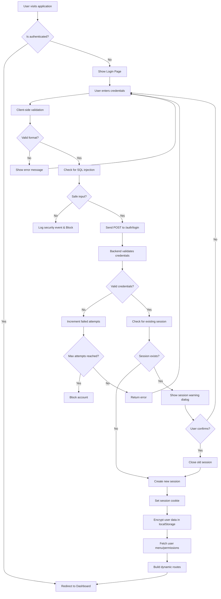

**Steps:**

1. **User Access**: User navigates to the application
2. **Auth Check**: Check if user has valid session
3. **Login Page**: Display login form if not authenticated
4. **Input Validation**: 
   - Check email/username format
   - Validate password length (6-20 characters)
   - Scan for SQL injection patterns
   - Scan for XSS attempts
5. **API Request**: Send credentials to backend
6. **Backend Validation**:
   - Verify credentials against database
   - Check account status (active/blocked)
   - Track failed login attempts
7. **Session Check**: Check for existing active session
8. **Session Warning** (if exists):
   - Display warning with last login details
   - User can force new session or cancel
9. **Session Creation**:
   - Generate secure session ID
   - Create HTTP-only cookie
   - Store session in database
10. **Client Setup**:
    - Encrypt user data (username, lang) in localStorage
    - Set `isLogged` flag
    - Fetch user menu permissions
11. **Route Generation**: Build dynamic routes based on role
12. **Redirect**: Navigate to dashboard

### 2. Duplicate Session Handling

**Scenario**: User logs in while already having an active session

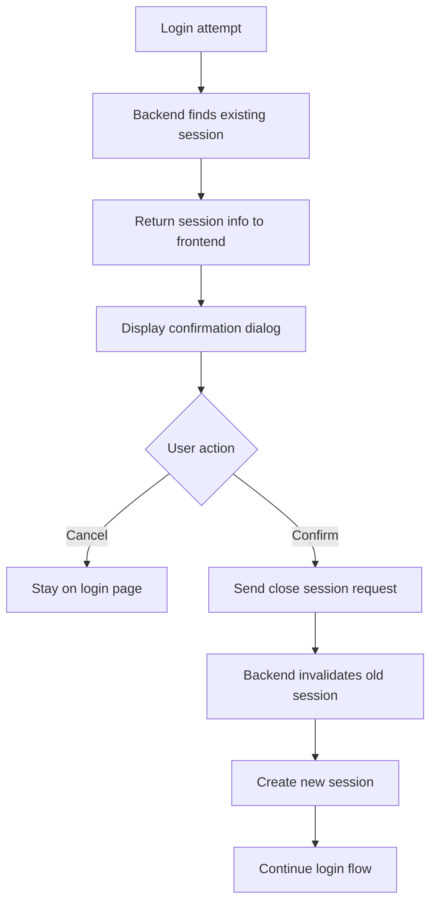

**Dialog Message**:
```
You already have an active session.
Last activity: 2024-01-15 10:30
IP Address: 192.168.1.100

Do you want to close the previous session and continue?
```

### 3. Logout Flow

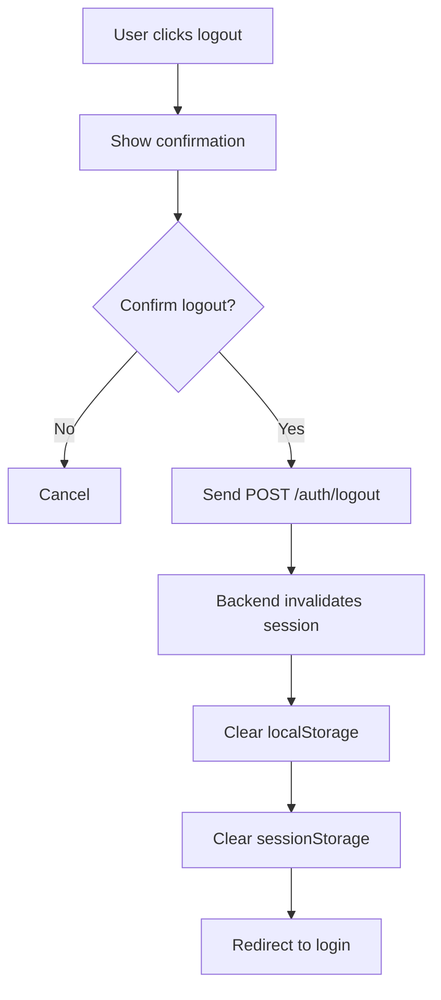

### 4. Auto-Logout Flow

**Triggers**:
- Session expiration
- Account blocked
- Account deleted
- Permission revoked
- Security violation detected

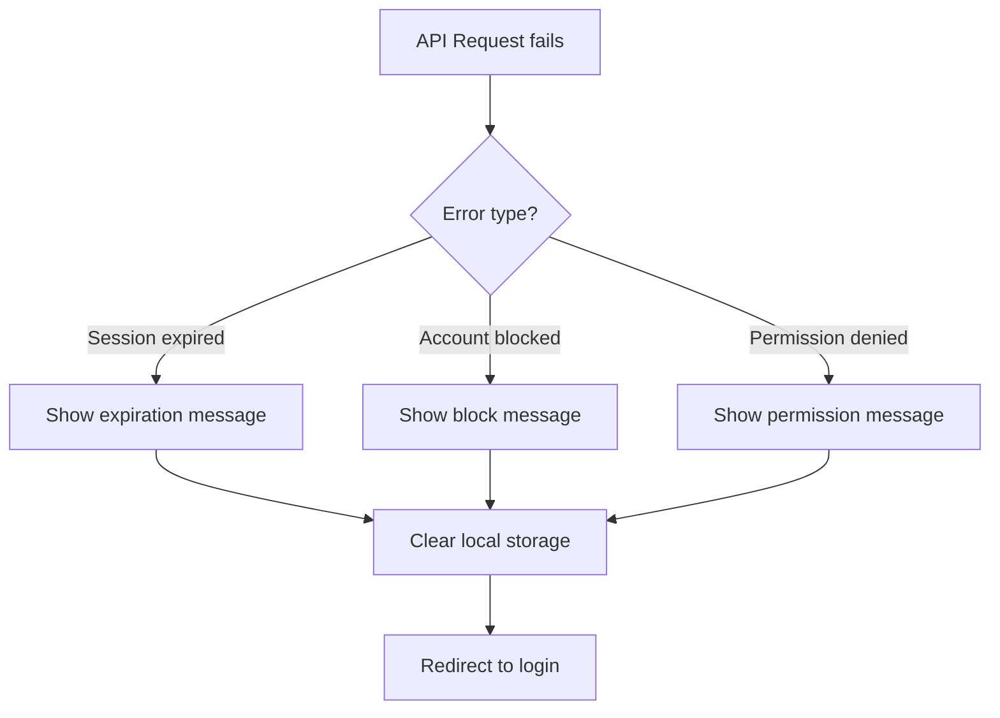

## User Management Workflows

### 1. Create New User

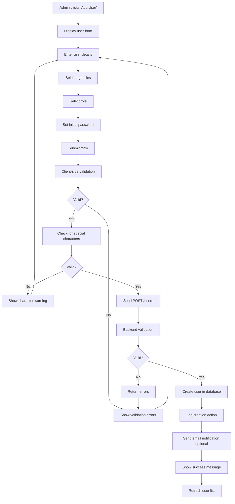

**Form Fields**:
- **Username** (required, unique)
- **Email** (required, valid format)
- **Phone** (optional, 10 digits)
- **Password** (required, 6-20 characters)
- **Role** (required, dropdown)
- **Agencies** (required, multi-select)
- **Status** (active/inactive)

**Validation Rules**:
```javascript
{
  username: {
    required: true,
    minLength: 3,
    maxLength: 50,
    pattern: /^[a-zA-Z0-9_-]+$/,
    noSpecialChars: ['.', '/', '_', '-']
  },
  email: {
    required: true,
    format: /^[^\s@]+@[^\s@]+\.[^\s@]+$/
  },
  password: {
    required: true,
    minLength: 6,
    maxLength: 20
  },
  phone: {
    optional: true,
    pattern: /^\d{10}$/
  },
  agencies: {
    required: true,
    minCount: 1
  }
}
```

### 2. Edit User Information

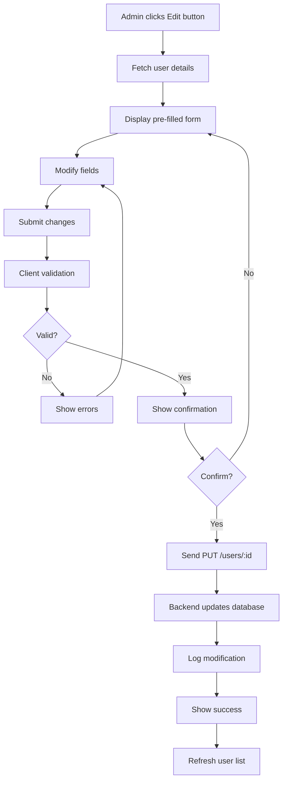

**Editable Fields**:
- Email
- Phone
- Role
- Agencies
- Status (active/inactive)

**Non-Editable**:
- Username (unique identifier)
- Creation date
- Created by

### 3. Reset User Password

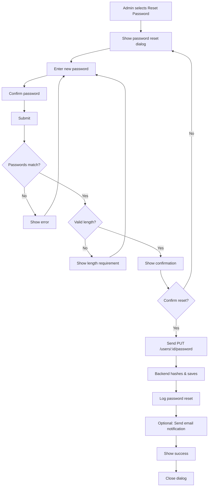

**Password Requirements**:
- Minimum 6 characters
- Maximum 20 characters
- Cannot be same as username
- Must match confirmation

### 4. Block/Unblock User

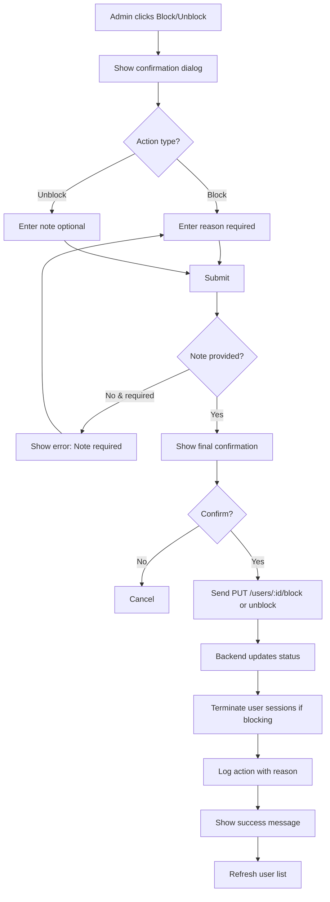

**Block Reasons**:
- Security violation
- Policy violation
- Administrative action
- Suspicious activity
- SQL injection attempt
- XSS attempt
- Custom reason

### 5. Assign Agencies to User

```mermaid
graph TD
    A[Admin clicks Assign Agencies] --> B[Fetch user's current agencies]
    B --> C[Fetch all available agencies]
    C --> D[Display dual-list selector]
    D --> E[Available Agencies | Assigned Agencies]
    E --> F[User moves agencies between lists]
    F --> G[Submit changes]
    G --> H{At least 1 agency?}
    H -->|No| I[Show error: Min 1 agency]
    I --> F
    H -->|Yes| J[Show confirmation]
    J --> K{Confirm?}
    K -->|No| F
    K -->|Yes| L[Send PUT /users/:id/agencies]
    L --> M[Backend updates relations]
    M --> N[Log agency assignment changes]
    N --> O[Update user menu permissions]
    O --> P[Show success]
    P --> Q[Close dialog]
```

### 6. Delete User

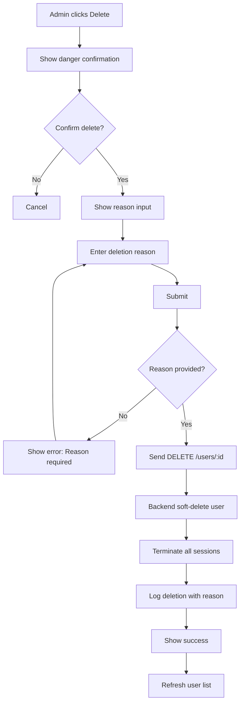

**Deletion Types**:
- **Soft Delete** (default): Mark as deleted, keep data
- **Hard Delete** (admin only): Permanently remove data

## Agency Management Workflows

### 1. Create New Agency

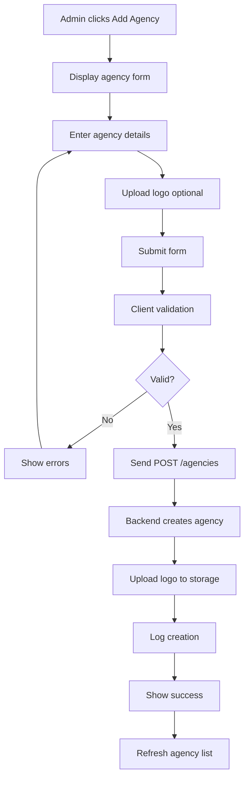

**Form Fields**:
- **Name (French)** (required)
- **Name (Arabic)** (required)
- **Phone** (optional)
- **Email** (optional)
- **Logo** (optional, drag-drop or browse)
- **Status** (active/inactive)

### 2. Edit Agency

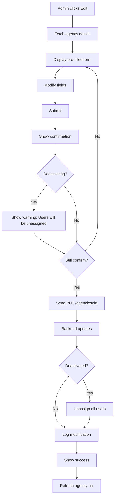

### 3. Update Agency Logo

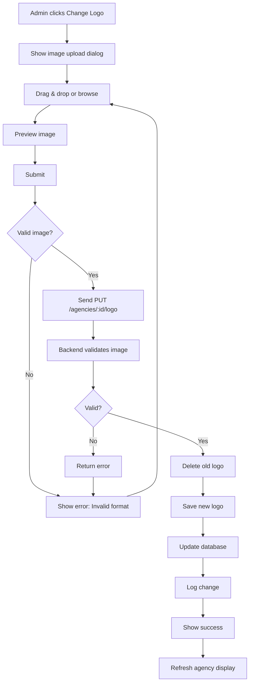

**Image Requirements**:
- **Formats**: PNG, JPG, JPEG, SVG
- **Max Size**: 2MB
- **Recommended**: 200x200px minimum
- **Aspect Ratio**: Square preferred

### 4. Assign Users to Agency

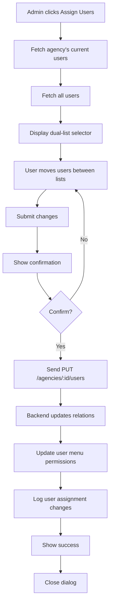

## Content Management Workflows

### 1. View Agency Content

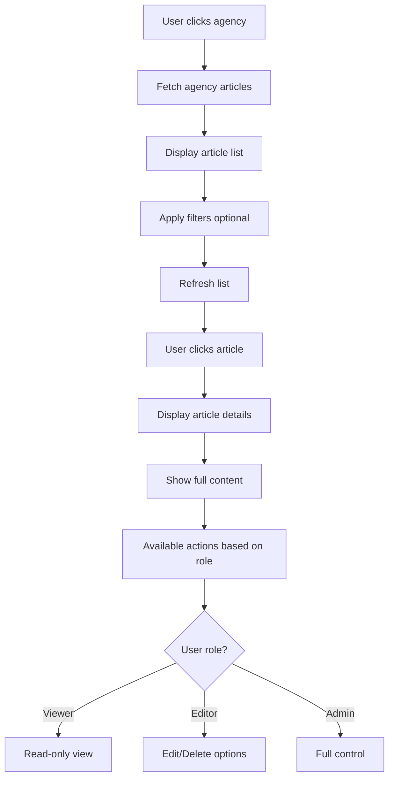

### 2. Search and Filter Content

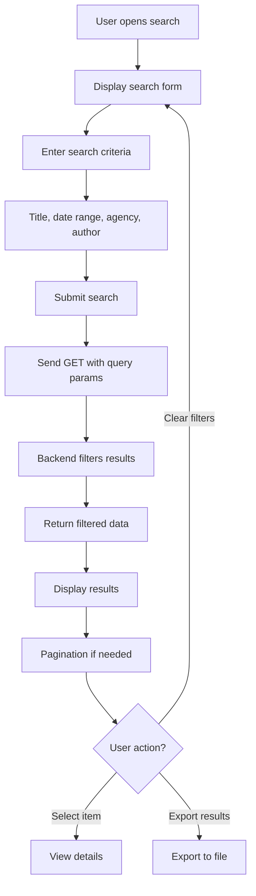

## Logging & Monitoring Workflows

### 1. View System Logs

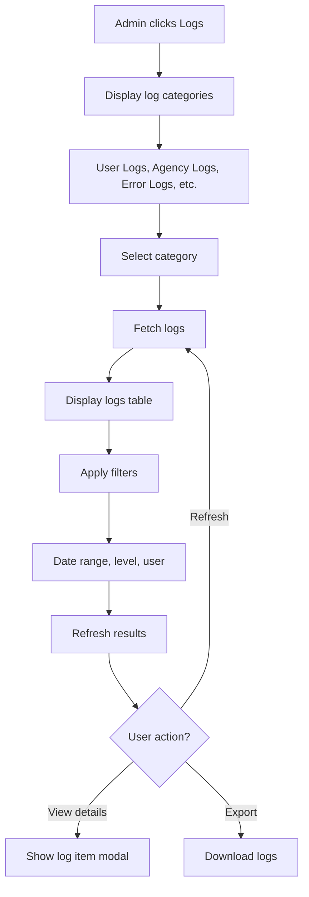

### 2. View Active Sessions

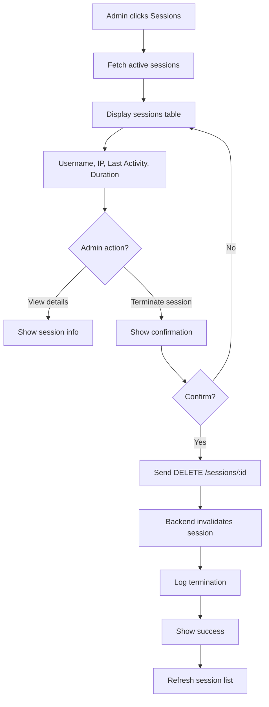

### 3. Export Logs

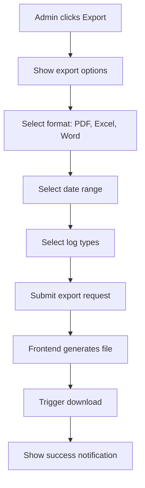

## Configuration Workflows

### 1. Update User Preferences

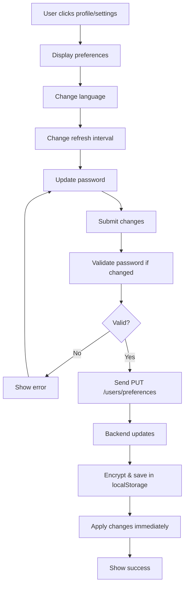

### 2. System Configuration (Super Admin)

```mermaid
graph TD
    A[Super Admin clicks Configuration] --> B[Display config sections]
    B --> C[General, Security, Notifications]
    C --> D[Modify settings]
    D --> E[Submit changes]
    E --> F[Show confirmation]
    F --> G{Critical changes?}
    G -->|Yes| H[Show warning & require reason]
    H --> I[Enter reason]
    I --> J{Confirm?}
    G -->|No| J
    J -->|No| D
    J -->|Yes| K[Send PUT /config]
    K --> L[Backend updates]
    L --> M[Log config change]
    M --> N[Apply changes]
    N --> O[Show success]
    O --> P[Restart services if needed]
```

---

**Last Updated**: 2024
**Author**: APS Development Team
