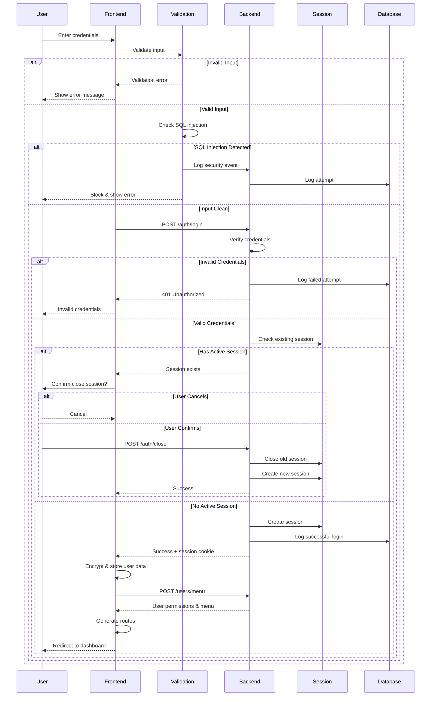

# 🔄 Workflow Documentation

## Table of Contents

- [Overview](#overview)
- [User Authentication Workflow](#user-authentication-workflow)
- [User Management Workflow](#user-management-workflow)
- [Agency Management Workflow](#agency-management-workflow)
- [Content Lifecycle](#content-lifecycle)
- [Configuration Management](#configuration-management)
- [Session Management](#session-management)
- [Logging & Auditing](#logging--auditing)
- [Error Handling Workflow](#error-handling-workflow)
- [Workflow Diagrams](#workflow-diagrams)

---

## Overview

This document describes the operational workflows within the APS News Dashboard, detailing how different processes flow through the system from initiation to completion.

### Workflow Principles

1. **User-Centric**: Workflows designed for ease of use
2. **Secure by Default**: Security checks at each step
3. **Auditable**: All actions logged
4. **Recoverable**: Ability to rollback or undo
5. **Efficient**: Minimal steps to complete tasks

---

## User Authentication Workflow

### Login Process



### Detailed Steps

#### 1. User Input Phase

```javascript
// User enters credentials
username: "john.doe"
password: "SecurePass123"
```

#### 2. Frontend Validation

```javascript
// Check password length
if (password.length < 6 || password.length > 20) {
  return error("Password must be 6-20 characters");
}

// Check for SQL injection
if (detectSQLInjection(username) || detectSQLInjection(password)) {
  logSecurityEvent("SQL_INJECTION_ATTEMPT");
  blockUser();
  return error("Invalid credentials");
}
```

#### 3. Backend Authentication

```javascript
// POST /auth/login
{
  username: "john.doe",
  password: "SecurePass123"
}

// Backend verifies:
// 1. User exists
// 2. Password matches (bcrypt compare)
// 3. Account not blocked
// 4. Check existing sessions
```

#### 4. Session Creation

```javascript
// If authentication successful
session.create({
  userId: user.id,
  username: user.username,
  role: user.role,
  expiresAt: Date.now() + 24 * 60 * 60 * 1000  // 24 hours
});

// Set HTTP-only cookie
res.cookie('sessionId', sessionId, {
  httpOnly: true,
  secure: true,
  sameSite: 'strict'
});
```

#### 5. Permission Loading

```javascript
// GET /users/menu
// Returns user-specific menu based on role and agencies

Response: {
  "Acceuil": "Acceuil",
  "Utilisateurs": "Utilisateurs",
  "Agences": {
    "Fils de Presse": [...]
  }
}
```

#### 6. Route Generation

```javascript
// Frontend dynamically generates routes
const routes = generateRoutesFromMenu(menuData);
setRoutes(routes);

// User redirected to first available route
navigate(routes[0].path);
```

---

## User Management Workflow

### Creating a New User

```
Administrator
    ↓
[1] Navigate to Users → Add User
    ↓
[2] Fill User Form
    - Username
    - Email
    - Password
    - First/Last Name
    - Phone
    - Role
    - Agencies
    ↓
[3] Frontend Validation
    - Required fields
    - Email format
    - Phone format
    - Password strength
    ↓
[4] Submit → POST /users
    ↓
[5] Backend Validation
    - Check username uniqueness
    - Check email uniqueness
    - Validate permissions
    ↓
[6] Create User in Database
    - Hash password
    - Assign role
    - Assign agencies
    - Set initial status
    ↓
[7] Log Action
    - Who created
    - When created
    - User details
    ↓
[8] Success Response
    ↓
[9] Frontend Updates
    - Show success message
    - Refresh user list
    - Clear form
    ↓
[10] Optional: Send Welcome Email
```

### Detailed Flow

#### Step 1: Navigate to Form

```javascript
// User clicks "Add User" button
// Checks permission
if (hasPermission("CREATE_USER")) {
  navigate("/utilisateurs/add");
}
```

#### Step 2: Fill Form

```javascript
const userData = {
  username: "jane.smith",
  email: "jane@aps.dz",
  password: "SecurePass456",
  firstName: "Jane",
  lastName: "Smith",
  phone: "0123456789",
  role: "editor",
  agencies: [1, 2]  // Agency IDs
};
```

#### Step 3: Frontend Validation

```javascript
// Validate email
if (!validateEmail(email)) {
  return setError("Invalid email format");
}

// Validate phone
if (!validatePhone(phone)) {
  return setError("Invalid phone format");
}

// Validate password
if (password.length < 6 || password.length > 20) {
  return setError("Password must be 6-20 characters");
}

// Check SQL injection
if (detectSQLInjection(username)) {
  logSecurityEvent();
  return setError("Invalid input");
}
```

#### Step 4-6: Backend Processing

```javascript
// POST /users
// Backend:
// 1. Validates input
// 2. Checks uniqueness
// 3. Hashes password
// 4. Creates user record
// 5. Assigns role and agencies
// 6. Logs action

const hashedPassword = await bcrypt.hash(password, 12);
const user = await User.create({
  username,
  email,
  password: hashedPassword,
  firstName,
  lastName,
  phone,
  role,
  status: 'active'
});

// Assign agencies
await UserAgency.bulkCreate(
  agencies.map(agencyId => ({
    userId: user.id,
    agencyId
  }))
);
```

#### Step 7: Logging

```javascript
await Log.create({
  type: "USER_MANAGEMENT",
  action: "CREATE_USER",
  userId: currentUser.id,
  targetUserId: user.id,
  details: {
    username: user.username,
    role: user.role,
    agencies: agencies
  }
});
```

---

## Agency Management Workflow

### Agency Content Publishing Workflow

```
Editor
    ↓
[1] Navigate to Agency
    ↓
[2] Create New Content
    - Title
    - Body
    - Category
    - Images
    ↓
[3] Save as Draft
    ↓
[4] Review Content
    ↓
[5] Submit for Approval
    ↓
Senior Editor
    ↓
[6] Review Submission
    - Check content quality
    - Verify facts
    - Check formatting
    ↓
[7] Decision
    ↓
    ├─ [Reject] → Back to Editor with comments
    │
    └─ [Approve] → Mark as Approved
        ↓
Chief Editor
        ↓
[8] Final Review
        ↓
[9] Decision
        ↓
        ├─ [Reject] → Back to Senior Editor
        │
        └─ [Publish] → Content goes live
            ↓
[10] Notify Subscribers
            ↓
[11] Update Statistics
            ↓
[12] Log Publication
```

### Content Lifecycle States

```javascript
const CONTENT_STATES = {
  DRAFT: "draft",              // Being edited
  PENDING: "pending",          // Awaiting review
  APPROVED: "approved",        // Approved but not published
  PUBLISHED: "published",      // Live content
  ARCHIVED: "archived",        // No longer active
  REJECTED: "rejected"         // Rejected by reviewer
};
```

### State Transitions

```javascript
// Draft → Pending (Submit)
if (currentState === "draft" && action === "submit") {
  if (hasPermission("SUBMIT_CONTENT")) {
    updateState("pending");
    notifyReviewers();
  }
}

// Pending → Approved (Approve)
if (currentState === "pending" && action === "approve") {
  if (hasPermission("APPROVE_CONTENT")) {
    updateState("approved");
    notifyAuthor("Content approved");
  }
}

// Approved → Published (Publish)
if (currentState === "approved" && action === "publish") {
  if (hasPermission("PUBLISH_CONTENT")) {
    updateState("published");
    publishDate = Date.now();
    notifySubscribers();
  }
}
```

---

## Configuration Management

### System Configuration Workflow

```
Administrator
    ↓
[1] Navigate to Configuration
    ↓
[2] Select Configuration Type
    - Agency Settings
    - User Settings
    - System Settings
    ↓
[3] View Current Configuration
    ↓
[4] Modify Settings
    ↓
[5] Validate Changes
    - Format validation
    - Business rule validation
    - Security validation
    ↓
[6] Preview Changes
    ↓
[7] Confirm Changes
    ↓
[8] Apply Configuration
    - Update database
    - Clear cache
    - Notify affected services
    ↓
[9] Log Configuration Change
    - What changed
    - Who changed it
    - When changed
    - Old vs new values
    ↓
[10] Success Notification
```

### Configuration Change Example

```javascript
// Agency Image Configuration
{
  action: "UPDATE_AGENCY_IMAGE",
  agencyId: 1,
  oldImage: "/images/old-logo.png",
  newImage: "/images/new-logo.png",
  changedBy: "admin",
  changedAt: "2024-10-26T10:30:00Z",
  reason: "Rebranding"
}

// Log change
await ConfigLog.create({
  type: "AGENCY_SETTINGS",
  action: "UPDATE_IMAGE",
  agencyId: 1,
  userId: currentUser.id,
  changes: {
    image: {
      old: oldImage,
      new: newImage
    }
  }
});

// Clear cache
cache.invalidate(`agency-${agencyId}`);

// Notify
notifyAgencyUsers(agencyId, "Agency image updated");
```

---

## Session Management

### Session Lifecycle

```
User Login
    ↓
[1] Create Session
    - Generate session ID
    - Set expiration
    - Store user data
    - Create HTTP-only cookie
    ↓
[2] Active Session
    - Track activity
    - Update last activity time
    - Validate on each request
    ↓
[3] Session Validation (Each Request)
    - Check session exists
    - Check not expired
    - Check user active
    - Update last activity
    ↓
[4] Session Renewal
    - If activity within threshold
    - Extend expiration
    ↓
[5] Session Termination
    ↓
    ├─ User Logout (Manual)
    │   - Destroy session
    │   - Clear cookie
    │   - Log logout
    │
    ├─ Session Expiration (Automatic)
    │   - Session timeout (24h)
    │   - Inactivity timeout (2h)
    │   - Force logout
    │
    ├─ New Login (Replace)
    │   - Close old session
    │   - Create new session
    │
    └─ Admin Action (Force)
        - Admin terminates session
        - Security event
```

### Concurrent Session Handling

```javascript
// User attempts login
const existingSessions = await Session.findAll({
  where: { userId: user.id, active: true }
});

if (existingSessions.length > 0) {
  // Notify user of existing session
  return {
    success: true,
    hasSession: true,
    sessionInfo: {
      loginTime: existingSessions[0].createdAt,
      ipAddress: existingSessions[0].ipAddress,
      userAgent: existingSessions[0].userAgent
    },
    message: "You have an active session. Close it to continue?"
  };
}

// User confirms closing old session
if (userConfirms) {
  // Close all existing sessions
  await Session.update(
    { active: false },
    { where: { userId: user.id } }
  );
  
  // Create new session
  const newSession = await Session.create({
    userId: user.id,
    sessionId: generateSessionId(),
    ipAddress: req.ip,
    userAgent: req.get('user-agent'),
    expiresAt: Date.now() + 24 * 60 * 60 * 1000
  });
}
```

---

## Logging & Auditing

### Audit Trail Workflow

```
User Action
    ↓
[1] Capture Event
    - Action type
    - User ID
    - Timestamp
    - IP address
    - User agent
    - Request details
    ↓
[2] Categorize Event
    - User Management
    - Agency Management
    - Configuration
    - Security Event
    - Content Management
    ↓
[3] Extract Relevant Data
    - Who: User ID, username
    - What: Action performed
    - When: Timestamp
    - Where: IP address, location
    - Why: Context, reason
    - How: Method, parameters
    ↓
[4] Store Log Entry
    - Database: Permanent storage
    - File: Backup logs
    - SIEM: Security monitoring
    ↓
[5] Index for Search
    - By user
    - By date
    - By action
    - By resource
    ↓
[6] Alert if Necessary
    - Security violations
    - Policy breaches
    - Unusual patterns
```

### Log Entry Structure

```javascript
{
  id: "log-12345",
  timestamp: "2024-10-26T10:30:00.000Z",
  level: "INFO",  // INFO, WARN, ERROR, SECURITY
  category: "USER_MANAGEMENT",
  action: "CREATE_USER",
  
  // Actor
  userId: "123",
  username: "admin",
  role: "admin",
  ipAddress: "192.168.1.100",
  userAgent: "Mozilla/5.0...",
  
  // Target
  targetType: "USER",
  targetId: "456",
  targetName: "new.user",
  
  // Details
  details: {
    operation: "CREATE",
    fields: ["username", "email", "role"],
    values: {
      username: "new.user",
      email: "new@aps.dz",
      role: "editor"
    }
  },
  
  // Result
  success: true,
  statusCode: 201,
  message: "User created successfully",
  
  // Context
  sessionId: "session-abc-123",
  requestId: "req-xyz-789"
}
```

---

## Error Handling Workflow

### Error Processing Flow

```
Error Occurs
    ↓
[1] Catch Error
    - Try-catch block
    - Error boundary (React)
    - Global error handler
    ↓
[2] Classify Error
    - Validation error (400)
    - Authentication error (401)
    - Authorization error (403)
    - Not found (404)
    - Server error (500)
    - Network error
    ↓
[3] Log Error
    - Error message
    - Stack trace
    - User context
    - Request context
    ↓
[4] Sanitize Error
    - Remove sensitive data
    - Remove system details
    - Create user-friendly message
    ↓
[5] Determine Response
    ↓
    ├─ Session Error (401)
    │   - Clear local storage
    │   - Redirect to login
    │   - Show error toast
    │
    ├─ Permission Error (403)
    │   - Show "Access denied" message
    │   - Log attempt
    │   - Stay on current page
    │
    ├─ Validation Error (400/422)
    │   - Highlight fields
    │   - Show specific error
    │   - Keep user on form
    │
    ├─ Network Error
    │   - Show connection error
    │   - Offer retry
    │   - Check backend status
    │
    └─ Server Error (500)
        - Show generic message
        - Log detailed error
        - Offer support contact
```

### Error Recovery

```javascript
// Automatic retry for transient errors
const handleRequest = async (attempt = 1) => {
  try {
    const response = await apiCall();
    return response;
  } catch (error) {
    if (error.code === 'NETWORK_ERROR' && attempt < 3) {
      // Wait with exponential backoff
      await delay(Math.pow(2, attempt) * 1000);
      return handleRequest(attempt + 1);
    }
    
    if (error.status === 401) {
      // Session expired - redirect to login
      handleSessionExpired();
      return;
    }
    
    if (error.status === 500 && attempt < 2) {
      // Retry once for server errors
      await delay(2000);
      return handleRequest(attempt + 1);
    }
    
    // Cannot recover - show error
    handleError(error);
  }
};
```

---

## Workflow Diagrams

### Complete Application Flow

```
User Opens Application
    ↓
Check Authentication
    ↓
    ├─ Not Authenticated → Login Page
    │       ↓
    │   Enter Credentials
    │       ↓
    │   Validate & Authenticate
    │       ↓
    │   Create Session
    │       ↓
    └─→ Load Permissions
            ↓
        Generate Routes
            ↓
        Render Dashboard
            ↓
    ┌───────┴───────┐
    │               │
    ├─ View Content
    │   - Browse agencies
    │   - Search
    │   - View details
    │
    ├─ Manage Users (If permitted)
    │   - List users
    │   - Create/Edit/Delete
    │   - Assign roles
    │
    ├─ Manage Agencies (If permitted)
    │   - List agencies
    │   - Configure settings
    │   - Manage content
    │
    ├─ View Logs (If permitted)
    │   - Activity logs
    │   - Security logs
    │   - Sessions
    │
    └─ Configure System (If permitted)
        - System settings
        - Agency settings
        - User settings
```

### Data Flow

```
UI Component
    ↓
User Action (onClick, onSubmit)
    ↓
Validate Input (Frontend)
    ↓
Check Permissions
    ↓
Call API (useAxios)
    ↓
Send HTTP Request
    - Headers (auth, security)
    - Body (validated data)
    ↓
Backend Receives Request
    ↓
Validate Session
    ↓
Check Permissions (Backend)
    ↓
Validate Data (Backend)
    ↓
Execute Business Logic
    ↓
Update Database
    ↓
Log Action
    ↓
Prepare Response
    ↓
Send Response
    ↓
Frontend Receives Response
    ↓
Update UI State
    ↓
Show Notification
    ↓
Refresh Data (if needed)
```

---

## Best Practices

### Workflow Design

1. **Keep it Simple**: Minimize steps
2. **Make it Clear**: Each step has clear purpose
3. **Provide Feedback**: User knows what's happening
4. **Allow Reversal**: Undo/cancel options
5. **Handle Errors**: Graceful error handling

### Implementation

1. **Validate Early**: Check on frontend first
2. **Validate Again**: Always validate on backend
3. **Log Everything**: Complete audit trail
4. **Secure by Default**: Security checks at each step
5. **Test Thoroughly**: Test each workflow path

---

**Document Version**: 1.0  
**Last Updated**: October 2024  
**Maintained By**: APS Development Team
